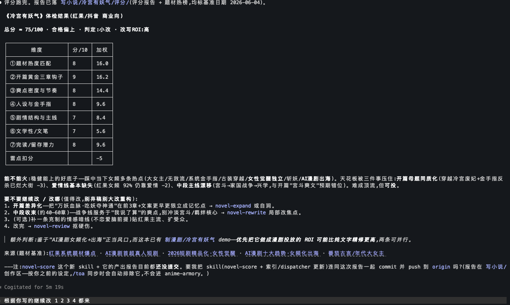
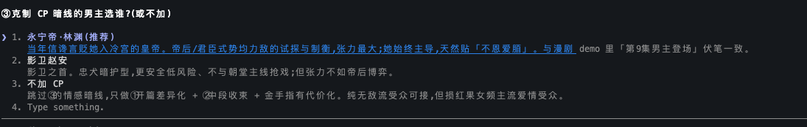
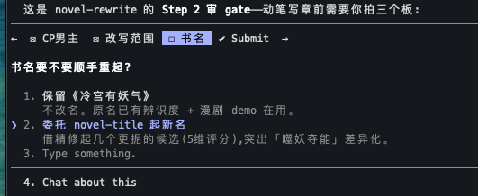
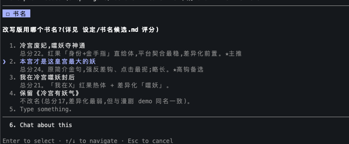

# anime-armory

工业级别的ai漫剧制作流水线，甚至还可以帮你写小说，有效规避版权问题！既可以快速的帮助初学者对 ai 漫剧制作整个流程进行了解；也可以辅助专业人员打造工业级的 ai 漫剧制作流水线。后期准备出桌面端，加入无限画布，敬请期待！(现阶段最好有个类似vscode这样的软件，方便编排和查看)

**AI 创作内容工厂** —— 一套可复用的 Claude Code skills，覆盖 **写小说→制漫剧**、**写歌→制MV** 两组「创作线 × 生产线」，外加公共换脸能力。仓库内的现有作品（`写小说/`·`制漫剧/`·`写歌/`·`制MV/`）是 **demo 演示**，展示这套 skill 的产出。

> skill 详细索引见 [`skills/README.md`](skills/README.md)；**其他 AI agent**（Cursor/Cline/Gemini-CLI…）进仓库先看 [`AGENTS.md`](AGENTS.md)；本文件是项目总览。

---

## 开跑前：本套流程需要三种 AI 能力

首次运行，直接在你的本地 ai 里打开本项目，然后**/novel2drama 【小说路径/小说】** 即可，首次运行，会有提示你预设一些东西，然后落在项目的设置里。
每一步跑完都有下一步提示要做什么，方便快捷


也可以直接输入 '/progress', '当前进度'， '进度'等提示词，查看当前项目进度，自动告知你下一步怎么做！
要把这套 skill 完整跑通，你需要凑齐**三种能力的 AI**——一种负责"想 / 写"，一种负责"画"，一种负责"动"：

| 能力 | 干什么 | 推荐 |
|---|---|---|
| **文字编排类 AI** | 拆集、写剧本/台词/分镜、调度整条流水线 | **Claude/GPT** |
| **文生图 AI** | 出定妆库 + 分镜画面 | **GPT的 Image 2**|
| **图生视频 AI** | 把分镜图变成会动的 clip | **建议Seedance 2.0，Kling也不错** |

**为什么强调"能在 CLI 里直接调"——这是本套流程最大的优势之一：**

给图生视频的服务（如 Seedance）**买高级会员**后，就能**直接在 CLI 里跑脚本自动调取**，告别"手动跑去另一个网站复制粘贴"的来回切换，极大解放生产力。

而且越跑越省心：

- 前面多跑完几遍完整流程后，让 skill **记录下你的喜好、风格、偏好设定**（落到各作品的 `_设置.md`）；
- 之后再生成就**越来越贴合你的预期**；
- 甚至赶工期时，真能做到**一键生成（按集为单位）**。

---

## 开跑前：本套流程需要三种 AI 能力

要把这套 skill 完整跑通，你需要凑齐**三种能力的 AI**——一种负责"想 / 写"，一种负责"画"，一种负责"动"：

| 能力 | 干什么 | 推荐 |
|---|---|---|
| **文字编排类 AI** | 拆集、写剧本/台词/分镜、调度整条流水线 | **Claude GPT** |
| **文生图 AI** | 出定妆库 + 分镜画面 | **GPT 的 Image 2**（image2） |
| **图生视频 AI** | 把分镜图变成会动的 clip | **建议 Seedance 2.0 Kling也不错** |

**为什么强调"能在 CLI 里直接调"——这是本套流程最大的优势之一：**

给图生视频的服务（如 Seedance）**买高级会员**后，就能**直接在 CLI 里跑脚本自动调取**，告别"手动跑去另一个网站复制粘贴"的来回切换，极大解放生产力。

而且越跑越省心：

- 前面多跑完几遍完整流程后，让 skill **记录下你的喜好、风格、偏好设定**（落到各作品的 `_设置.md`）；
- 之后再生成就**越来越贴合你的预期**；
- 甚至赶工期时，真能做到**一键生成（按集为单位）**。

---

## 四条线：创作线 × 生产线

成对、两两对应、**互不依赖**——创作线产成品（小说/歌），生产线把它做成视频（漫剧/MV）。衔接只在**成品文件层面**，不是 skill 依赖。

| 创作线（产成品） | 生产线（成品→视频） | 产物落 |
|---|---|---|
| **写小说** `novel-author` + `novel-*`<br>原创从零 / 取公版 / 起书名 / 外传 / 改写魔改 / 续写 / 扩写 / 精简 / 工艺 / 审稿 / 评分 | **制漫剧** `novel2drama` + `n2d-*`<br>拆集→配音→分镜→出图→出视频→合成（即梦/可灵/Seedance/Veo）+ 质检·自审 | `写小说/`<br>`制漫剧/` |
| **写歌** `song` + `song-*`<br>访谈作词 / 作曲+演唱 / 翻唱换声 + 质检·自审 | **制MV** `mv` + `mv-*`<br>卡点→出图→出视频→卡拉OK字幕→合成（自包含，不复用 n2d-*）+ 质检·自审 | `写歌/`<br>`制MV/` |

**公共能力**（不属任何家族，谁都能调）：
- `video-faceswap` / `image-faceswap` —— 视频/图片换脸（FaceFusion 本地底座）+ 强制 AI 标识，**仅本人/授权/合成脸**，带合规闸门。

每条线各有一个**调度入口** skill（`novel2drama` / `novel-author` / `song` / `mv`），读项目 `_进度.md` 路由到对应阶段。

**每条线都配一个 QA skill**（不生产内容、只审，双模 = 作品质检 + 流程自审）：`novel-review`（小说审稿）/ `n2d-review`（漫剧）/ `song-review`（歌）/ `mv-review`（MV）。机检（确定性脚本）+ 人判（语义/试听/读图），出严重度分级、定位到位置的报告；模式②还能联网对标市场，反过来优化产线自身。另有 `novel-score` 判小说"能不能火"。

---

## 重点生产线：novel2drama（小说 → AI 漫剧 / 短剧）

整个仓库的核心产线。`novel2drama` 是**总调度**：它不亲自干活，而是检查作品根、读 `_进度.md`，按阶段把你路由到对应的 `n2d-*` skill。一本小说到成片，走这条流水线：

| 阶段 | skill | 干什么 | 产物 |
|---|---|---|---|
| 0 调度 | `novel2drama` | 看作品根、读 `_进度.md`，决定下一步走哪个 skill | — |
| 1 剧本改编 | `n2d-script` | 拆集 → 每集戏剧节拍 + 配音台词 / BGM / 封面 / 角色卡·场景卡 / global_style（**先不做分镜**） | 剧本 + 素材卡 |
| 2 配音（前移） | `n2d-voice` | 台词 → 角色配音 + 拼接音轨 + **时长清单**（每句实测时长，驱动下游镜头时长） | 配音 + 时长 |
| 2′ 分镜设计 | `n2d-script`（回跑） | 用配音实测时长设计 分镜剧本 / 故事板(Clip 时长) / 素材清单 / 双语字幕 SRT | 分镜 + 故事板 |
| 3 出图 | `n2d-image` | 两层出图（**共享定妆库** + 本集分镜）→ 即梦 / Flux / Gemini 生图 | 分镜 PNG |
| 4 出视频 | `n2d-video` | 图生视频（即梦 / 可灵 / Veo / Seedance），按故事板运镜 | clips |
| 5 合成 | `n2d-compose` | clips + 配音 + BGM(自动 ducking) + 烧双语字幕 → 成片 | `成片.mp4` |

几个设计要点（决定成片能不能用）：
- **配音前移**：先配音拿到每句**实测时长**，再据此定镜头时长——避免"图都做完了才发现对不上节奏"。
- **两层出图锁一致性**：先用共享定妆库锁主角脸 / 场景 / 画风，再做分镜，人物跨镜不漂。
- **双语字幕**：面向海外投放，中英双语 SRT，`n2d-compose` 直接烧录。
- **demo**：`制漫剧/冷宫有妖气` —— 101 集拆集，第 1 集走完全套（含双语版 `出视频/第1集/demo_第1集_bilingual.mp4`）。

**推荐制作顺序（总纲）** —— 三条铁律决定了为什么是这个顺序（完整版见 [`skills/novel2drama/Q&A.md` Q30](skills/novel2drama/Q&A.md)）：
1. **配音前移·时长驱动**：先配音拿真实时长，再定分镜镜头时长（视频先行会截断台词或留死白）。
2. **先出图再图生视频**：图几分钱秒出可重抽，视频贵 1-2 个数量级——构图/人物在图阶段锁死，视频只控运动。
3. **定妆库先行·建库锚死**：先建角色/场景定妆当锚点，每镜从库里派生 + 拼锚点句（一致性是漫剧头号死因）。

> 顺序：`拆集出台词 → 配音(真实时长) → 时长驱动定分镜 → 建定妆库 → 逐镜派生出图 → 图生视频 → 合成烧字幕`。**贵的步骤永远排在时长定死、视觉锁死之后**；**第 1 集先打样、过 `/n2d-review` 验收再批量**（第 1 集的定妆库是后面所有集复用的资产）。

> **仙侠武侠打斗**（核心爽点，AI 直接生必崩）有专门工艺：**一招拆帧 → 命中帧单独出图当首尾帧锚 → 图生视频只插值 → 后期顿帧+音效补打击感**，全链已挂接 script/image/video/compose/review。完整拆招与 worked example 见 [`skills/n2d-script/references/打斗分镜.md`](skills/n2d-script/references/打斗分镜.md)（亦见 Q&A Q31）。

> **仙侠其他奇观**（御剑飞行/追逐/渡劫突破/炼丹炼器/大阵法阵/大场面 establish/斗法对轰/神魂(神识·元神出窍·夺舍)，同样核心卖点、AI 直接生必崩）有平行工艺：**飞行追逐「锁姿态、动背景与镜头」（速度感来自背景不来自人物变形）→ 渡劫炼丹法阵对轰「拆递增 + 爆发帧(命中·撞点)单独出图 + 奇观元素入库锁死」→ 神魂「元神=肉身半透明派生治"二我"、神识靠波纹给信息」→ 大场面「三镜由远及近 + 比例尺 + 地标复用」**，全链同样挂接 script/image/video/compose/review。完整拆招与示例见 [`skills/n2d-script/references/仙侠场面分镜.md`](skills/n2d-script/references/仙侠场面分镜.md)（亦见 Q&A Q33）。

> 写歌→制MV 的 `mv` 线是同构的平行产线（卡点→出图→出视频→卡拉OK→合成，自包含不复用 n2d-*）。旗舰 demo 见下方 `仗剑下山`。

---

## 重点创作线：novel-author（几个字 / 一本书 → 成稿小说）

漫剧产线的上游。`novel-author` 是**总调度**（与 `novel2drama` 同构）：它不亲自写，而是看输入（几个字 / 想法 / 书名 / URL / 路径 / 配角名 / 动作），或读已有 `写小说/<项目>/` 的 `_进度.md`，把你路由到对应的 `novel-*` skill。和 novel2drama 做漫剧视频、产物落 `制漫剧/` 相对，这条线做**纯文本小说**、产物统一落 `写小说/<项目>/`——成稿后即可交给 novel2drama 改编漫剧。

| 你给的 / 想做的 | skill | 干什么 | 产物 |
|---|---|---|---|
| 调度 | `novel-author` | 看输入 / 读 `_进度.md`，决定走哪个子 skill（**自身不写作**） | — |
| 几个字 / 想法 / 碎片（无源文） | `novel-create` | 访谈 → 创作蓝图 → 设定圣经 → 章纲 → Demo → 逐章成书 | 成稿小说 |
| 书名 / 章节目录 URL | `novel-fetch` | 联网抓公版全文 | txt + docx |
| 已有书，想起名 | `novel-title` | 5–8 候选 × 5 维打分排序 | 书名候选 |
| 源书 + 配角名 | `novel-spinoff` | 配角平行视角外传，锚点处锁原作事件 | 外传 + 章纲 |
| 源书，改主线 / 换设定 | `novel-rewrite` | 魔改 / 翻拍转化型重写 | 新版小说 |
| 源书，接末章往后写 | `novel-continue` | 续编（完本后）/ 接更（接未完本） | 新章节 |
| 短文加厚 / 长文压缩 | `novel-expand` / `novel-condense` | 加细节 / 砍描写并章 | 长版 / 短版 |
| 已写章节，查硬伤 | `novel-review` | 串视角 / 人设崩 / 设定矛盾 / 原文照搬定位报告 | 审稿报告 |
| 已写章节，判能不能火 | `novel-score` | 联网对标热榜，多维打分 + 改写 ROI 判定 | 评分体检 |
| 写作工艺问题 | `novel-craft` | 章纲 / 单章 / 扩缩工艺基元（被其他 novel-* 引用） | — |

几个设计要点（与 novel2drama 同构）：
- **只路由不写作**：novel-author 把意图分到对的工具——续 / 扩 / 视角 / 改四者最易混（其 SKILL.md 有专门警示框），review（查硬伤）与 score（判能不能火）也要分清。
- **合法性铁律前置**：派生类（spinoff / rewrite / expand / condense）默认只做公版 / 自有 / 授权；命中付费墙或当代版权网文即拒，调度入口先筛一遍。
- **节拍优先字数兜底**：章 = 一个戏剧节拍单元；每章字数按平台档（`novel-craft/references/split.md` 字数分档，`novel-create --scale` 与之 1:1）只是兜底区间，不是硬切。
- **持续改进**：跑流水线中沉淀的可复用经验回写 `novel-craft` / `novel-author/Q&A.md`（meta-capability）。
- **demo**：`写小说/仙界闭关小能手-王敦外传`（配角外传，对齐 1179 章原作锚点）等 —— 进度见各自 `_进度.md`。

> 写歌的 `song` 线是同构的平行创作线（访谈作词 → 作曲演唱 → 成品歌），产物交给 `mv` 做视频，正如小说成稿交给 `novel2drama`。

---

## 想做出好成品：你才是导演

工具能把**流程**跑通，但**成片好不好，更多取决于你的品鉴力，而不是 skill**。请把自己当**导演**，而不是按按钮的人：

- **会挑**：生图 / 生视频 / 出歌都有随机性——**一次多生几版，由你来挑**：角色对不对味、运镜有没有张力、爽点卡没卡在鼓点上。skill 默认就鼓励"多版择优"。
- **会看节奏**：单集切多长不是按字数，而是按**爽点 / 钩子**落进验收区间；副歌、反转要踩节拍。你得有"这里该快切、这里该停一拍"的判断。
- **会定调**：画风、音色、运镜语言这些"选择点"，skill 会问你一次，但**审美定成什么样是你的事**——同一段素材，导演眼光不同，成片天差地别。

## 规模化制作（要批量稳定出片时）

零散做几集，靠手挑就够了；**要成规模、稳定量产**，建议沉淀"资产"而不是每次重抽随机结果：

- **角色 LoRA**：给主角 / 核心配角训练 LoRA，锁死人物长相，跨集跨镜一致，不再靠定妆图碰运气。
- **资产库**：把定妆图、场景图、音色样本、BGM、运镜模板沉淀成可复用素材库（每剧 `common/` 已是雏形），新集直接调用。通用三类 = 角色/场景/道具；**仙侠玄幻另立 法宝库 / 特效库**（本命法宝按形态多态、剑气/灵力光效锁颜色拖尾，和角色脸同等对待）。题材自适应，都市宅斗不必（见 Q&A Q32）。
- **参数固化**：把验证过的 prompt / 运镜 / 卡点参数写进作品的 `_设置.md`，同剧沉默沿用，减少返工。

> 这些**不用你全记住**——**相应 skill 会在合适的环节主动提示你**：什么时候该先建定妆库、该多生几版、该考虑接 LoRA、该把参数固化进 `_设置.md`。跟着提示走，会越做越省、越做越稳。

---

## 设计原则：skill 通用，选择私有

- **skill 保持通用**：不把平台/后端/分辨率/时长写死成唯一路径。凡「让用户选」的都是**选择点**。
- **选择是私有的**，存在用户自己的空间、不进共享 skill 代码：
  - 每作品 `<作品根>/_设置.md`（权威，与 `_进度.md` 并列）
  - 全局默认 `创作偏好-默认.md`（跨项目个人默认，开新项目预填）——**个人私有文件，不进公开库**
- **行为**：选择点首次问一次 → 写 `_设置.md` → 同项目沉默沿用；合规/不可逆/花钱多的点每次仍确认。
- 机制与全部选择点目录见 [`skills/_偏好约定.md`](skills/_偏好约定.md)。

几个已固化的默认（都可在 `_设置.md` 改）：
- 生视频/生图 = 即梦；视频分辨率 = 720p（可 1080p）
- 配音 = CosyVoice；作曲 = Suno（云）
- **单集时长 = 验收区间**：默认「前长后短」第1集 120–180s / 其余集 60–120s——最终切多长**由爽点/钩子等节拍锚定，落进区间即可**（字数只切粗胚→节拍重切→配音实测）。

---

## 目录结构

```
anime-armory/
├── README.md  AGENTS.md  TODO.md  .gitignore
├── skills/                          ← 全部自定义 skill（真身，扁平按前缀分族）
│   ├── _偏好约定.md                通用偏好机制 + 选择点目录
│   ├── README.md                    skill 索引（含「工具中立 / 跨 AI 使用」说明）
│   ├── novel-author/ novel-*        写小说（create/fetch/title/spinoff/rewrite/
│   │                                continue/expand/condense/craft/review/score）
│   ├── novel2drama/ n2d-*           制漫剧（script/voice/image/video/compose/review）
│   ├── song/ song-*                 写歌（lyrics/compose/cover/review）
│   ├── mv/ mv-*                     制MV（beat/image/video/lyric-sync/compose/review）
│   └── video-faceswap/ image-faceswap/   公共换脸
├── .claude/skills → ../skills       ← 软链：供 Claude Code 自动发现（其他 AI 走 AGENTS.md）
│
├── 写小说/<项目>/                  ← 写小说产物（设定/章节/审稿/导出 + _进度.md + _设置.md）
├── 制漫剧/<剧名>/                  ← 制漫剧产物（小说/脚本/出图/出视频/成片 + common/_进度.md）
├── 写歌/<曲名>/                    ← 写歌产物（词/lyrics.md + 歌/song.wav + _进度.md）
└── 制MV/<曲名>/                    ← 制MV产物（节拍/出图/出视频/字幕/成片_MV.mp4）
```

## 快速开始

### **可以按照 demo 里的样子，在对应的创造区新建一个文件夹，然后在你的本地 AI agent 里就可以用自然语言的方式开始你的创造啦。**

- **写小说**：`/novel-author <书名/路径/想法/动作>` 路由；或直接 `/novel-create`（从零原创）、`/novel-fetch <书名>`、`/novel-spinoff <原作> <配角>`、`/novel-review <项目>`。
- **做漫剧**：`/novel2drama <小说路径或 制漫剧/项目>` → `/n2d-script` → `/n2d-voice` → `/n2d-script`(分镜) → `/n2d-image` → `/n2d-video` → `/n2d-compose`。
- **写歌**：`/song <主题/想法>` → `/song-lyrics` → `/song-compose`（→ `/song-cover` 可选）。
- **做MV**：`/mv <成品歌或 制MV/曲名>` → `/mv-beat` → `/mv-image` → `/mv-video` → `/mv-lyric-sync` → `/mv-compose`。
- **换脸**：`/image-faceswap`（图）/ `/video-faceswap`（视频）—— 先过合规闸门。

## 完整示例：把一本小说迭代优化（评级 → 改写 → 起名 → 提纲 → Demo 审稿 → 续完）

把小说**拖进 CLI**，用 `novel-author` 这条线走一个**优化闭环**——评分定方向、按建议改写、顺手测书名、出新提纲、先写前几章 Demo 自审、过关再续完。一轮跑下来出一版；**多跑几轮**，每轮拿上一版的评分/审稿结论再改，小说就被一层层打磨上去。下面用仓库里的 `写小说/冷宫有妖气` 走一遍：

**① 先评级——判"值不值得改、该改哪几维"**　`/novel-score 写小说/冷宫有妖气`

联网拉红果/抖音/番茄当下热榜做基准，多维打分 → 总分 + 平台档位 + 「过/小改/大改/弃稿重立」判定 + 改写 ROI，并**点名该改哪几维**。这就是下一步改写的施工图。



**② 一步步改写——按评分点名的弱项动刀**　`/novel-rewrite 写小说/冷宫有妖气`

novel-rewrite 把改写拆成一组**选择点**逐个过：先定核心改动（如③克制 CP 暗线的男主选谁、是否加），每个选项都标了与漫剧 demo 伏笔的一致性、对红果女频受众的影响，**给推荐、让你拍板**——不替你定故事。



**③ 顺手测书名**　改写范围里有「书名」一项，动笔前的审 gate 会问要不要重起；选「委托 `novel-title`」就借改写依据生成候选并 5 维打分。





**④ 出提纲**　书名/改动定了，重织**章纲**（三幕 + 反转 + 钩子，节拍优先字数兜底，见 `novel-craft/references/{outline,split}.md`）。章纲未敲定不进 Demo。

**⑤ 续写前几章 Demo + 自我审稿**　按新章纲先写**前 1–3 章 Demo**（每章一个戏剧节拍 + ≥1 钩子），随即 `/novel-review` 自审——查串视角/人设崩/设定矛盾/锚点漂移/原文照搬，出定位报告。**Demo 过关才批量往下写**（文风/爽点/设定自洽在这 1–3 章就能看出来）。

**⑥ 续完剩余章节**　Demo 定调后逐章续写到完结，写完再 `/novel-review` 分批回扫一致性。

> **如此可多来几回**：把这一版的评分 + 审稿结论当作下一轮 `/novel-score` 的输入，再改写 → 再起名 → 再 Demo → 再续完。每轮一个小版本，迭代收敛到"能火"的方向——这就是用 novel-* 线**优化**（而非一次性写完）一本小说的方式。


## 说明

- **现有作品 = demo 演示**：`写小说/`·`制漫剧/`·`写歌/`·`制MV/` 下的成品是展示 skill 产出的样例，可随意参考。
- **只想拿工具**：如果你想把这套 skill 单独拿去用、不带这些 demo 作品，见 [`TODO.md`](TODO.md)（如何剥离个人内容做成干净模板）。
- **版权**：demo 所用原文为作者本人作品 / 公版 / 已授权；**复用本工具时请自备合法素材**，公版/自有/已授权为准。
- **换脸合规**：换脸/克隆真人 = deepfake，强监管——仅本人/授权/合成脸，强制 AI 标识水印，绝不抹标识。
