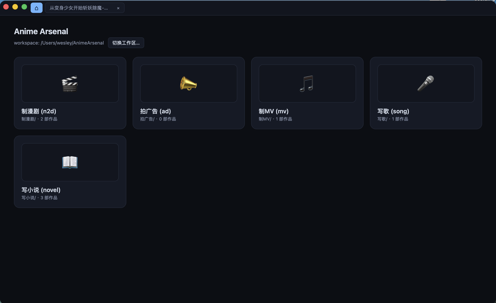
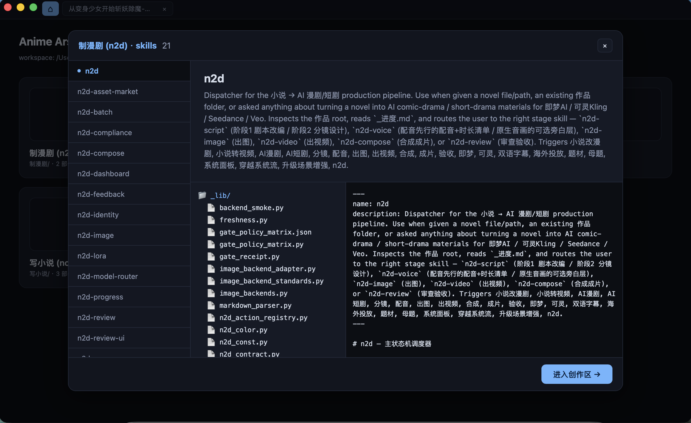
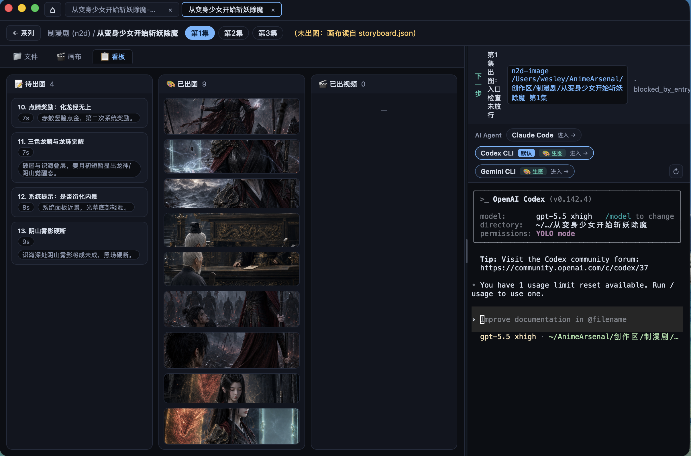
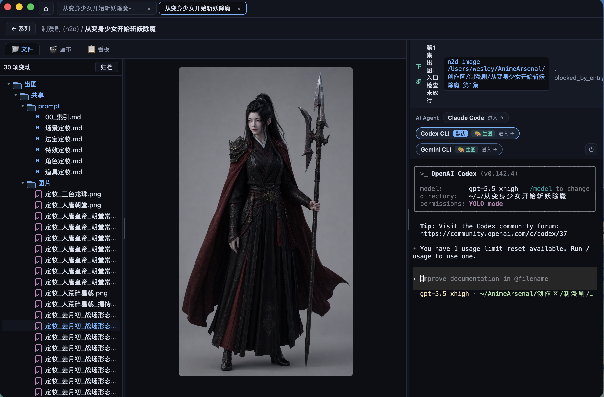

# anime-armory

**Language / 语言**：中文（默认） | [English](#en)

<a id="zh-cn"></a>

## 中文

一套面向 AI 内容生产的本地流水线：把一个点子、一本书、一首歌或一份客户需求，推进成可交付的小说、AI 漫剧短视频、漫画、AI 音乐 MV 或商业广告片。

仓库的核心不是单个脚本，而是根目录 `skills/` 下的一组可复用 workflow skill。它们构成六条彼此独立、可单独分发的生产线：

- **小说（novel）**：立项 / 观察素材 / 审美样本 -> 章纲 -> 写作 -> 审稿 / 评分 / 专业编辑 -> 导出
- **小说文本 -> AI 漫剧 / 短剧（n2d）**：拆集 -> 配音 -> 分镜 -> 出图 -> 出视频 -> 合成
- **漫画（comic）**：故事 / 点子 / 脚本 -> 分话大纲 -> 分格脚本 -> 页面排版 -> 出图 -> 嵌字 -> 长图导出
- **歌曲（song）**：作词 -> 作曲 / 多版挑版 -> 翻唱 / 换声 -> 审歌
- **音乐 MV（mv）**：歌曲入库 -> beatgrid -> 视觉蓝图 -> clip 规划 -> 出图 / 出视频 -> 卡拉 OK 字幕 -> 合成
- **广告片（ad）**：brief -> 创意 -> 脚本 / VO -> 分镜 -> 产品 / 场景 / 角色定妆 -> 出图 / 出视频 -> 交付件

产物统一落在 `创作区/` 下：`创作区/写小说/`、`创作区/制漫剧/`、`创作区/画漫画/`、`创作区/写歌/`、`创作区/制MV/`、`创作区/拍广告/`（跨项目可复用资产在 `资产库/`）。每个作品一个子目录，通常都有 `_进度.md` 和 `_设置.md` 来记录状态与选择。

> 给 AI agent 或人快速进仓库：先读 [AGENTS.md](AGENTS.md)。
> skill 完整索引与职责边界：读 [skills/README.md](skills/README.md)。

## 下载安装

开箱即用的安装包，点击直接下载（链接始终指向最新发布版本）：

| 安装包 | 平台 | 下载 |
|---|---|---|
| 🖥️ 桌面端 App | macOS Apple Silicon（M 系列，`.dmg`） | [**AnimeArmory_macos_arm64.dmg**](https://github.com/anton6202527/anime-armory/releases/download/v0.1.38/AnimeArmory_macos_arm64.dmg) |
| 🖥️ 桌面端 App | Windows（`.exe` 安装程序） | [**AnimeArmory_windows.exe**](https://github.com/anton6202527/anime-armory/releases/latest/download/AnimeArmory_windows.exe) |
| 🧩 VS Code 插件 | 跨平台（`.vsix`） | [**anime-armory.vsix**](https://github.com/anton6202527/anime-armory/releases/latest/download/anime-armory.vsix) |

- **桌面端 App**：macOS Apple Silicon（M 系列）下载 `.dmg` 拖入 `/Applications`；Windows 下载 `.exe` 安装程序。打开即用，内置全部 skill。macOS 隐私权限不会在安装阶段预授权，访问受保护目录时由系统按需提示。
- **VS Code 插件**：下载 `.vsix` 后，在 VS Code 命令面板执行 `Extensions: Install from VSIX…` 选中该文件安装。

> 下载链接由维护者发布时更新，指向 anime-armory Release 中对应安装包；桌面端 App 内置当前全部 skill。历史版本与校验和见 [Releases 页](https://github.com/anton6202527/anime-armory/releases)。维护者出新版见下方“自行打包发布”（推荐执行 `/r2a` 或 `/r2a --all`）。

## 桌面端 App 能做什么

桌面端 App 是 anime-armory 的本地制作中控台：打开后先选择工作区，再按生产线进入 `制漫剧`、`画漫画`、`拍广告`、`制MV`、`写歌`、`写小说` 等作品目录。它把原本散在文件夹、终端和 skill 文档里的信息收拢到一个界面里，让制作团队能直观看到每条线有多少作品、每个项目走到哪一步、下一步该调用哪个 skill。

进入项目后，App 会把左侧文件树、分镜画布 / 生产看板、右侧下一步提示和 AI agent 终端放在同一个工作台里。用户可以一边查看脚本、定妆图、分镜图、质检报告和生产数据，一边按右侧建议直接进入 Claude Code / Codex CLI / Gemini CLI 继续执行 `n2d-image`、`n2d-video`、`n2d-compose` 等阶段任务。

<table>
  <tr>
    <td width="50%">
      
      <br />
      <strong>生产线首页</strong><br />
      统一展示已接入桌面端的创作线，点击即可进入对应作品区。
    </td>
    <td width="50%">
      
      <br />
      <strong>内置 skill 浏览</strong><br />
      直接查看每条生产线的 skill 职责、触发条件和脚本文件，方便团队理解流水线能力边界。
    </td>
  </tr>
  <tr>
    <td width="50%">
      
      <br />
      <strong>项目生产看板</strong><br />
      按集数汇总待出图、已出图、已出视频状态，并在右侧给出下一步命令和 agent 入口。
    </td>
    <td width="50%">
      
      <br />
      <strong>文件预览 + AI 终端</strong><br />
      在同一屏查看素材、图片、Markdown、JSON 等产物，同时保留可执行命令的 AI agent 终端。
    </td>
  </tr>
</table>

### 核心资产是 skill —— 也可以不装 App，自行下载调试

本项目真正可复用的核心不是某个安装包，而是 `skills/` 下那组 workflow skill；安装包只是把它们包进了更顺手的界面。你完全可以跳过 App，直接拿到 skill 自己跑、自己改：

```bash
# 克隆仓库，skill 全在 skills/ 下
git clone https://github.com/anton6202527/anime-armory
cd anime-armory
```

或在上面 Release 页面下载源码包 / starter 包。拿到后用本地 AI agent（Claude Code、Codex 等）打开目录，先读 [AGENTS.md](AGENTS.md)，再按下面的入口 skill 调试；改 skill、加后端、调提示词都直接编辑 `skills/<name>/SKILL.md` 即可。

## 先看 Demo

仓库里现有作品就是端到端样例，可以直接看目录结构、进度文件和产物组织方式。

| 类型 | 示例 | 说明 |
|---|---|---|
| 漫剧工程 | `创作区/制漫剧/本宫才是这皇宫最大的妖/` | 小说源、脚本、设定库、出图、合规、生产数据等工程结构 |

这些 demo 默认按作者本人 / 公版 / 已授权素材展示。复用本工具时请自备合法素材。

## 快速开始

在本地 AI agent 里打开仓库，然后按目标选择入口 skill。入口 skill 会读取作品 `_进度.md`，判断下一步要走哪个子阶段。

skill 名称按跨工具兼容写法展示：直接写 `n2d-image`、`n2d-progress` 这类裸名，不加 `/`。部分 AI agent 会把 `/n2d-image` 当成自身不支持的斜杠命令。

| 你想做什么 | 入口 |
|---|---|
| 写小说 / 导入源书 / 观察素材 / 审美样本 / 审稿评分 | `novel <想法、源书或 创作区/写小说/项目>` |
| 把小说做成 AI 漫剧 | `n2d <小说路径或 创作区/制漫剧/项目>` |
| 画漫画 / 条漫页漫 / 分格脚本 / 长图导出 | `comic <想法、源本或 创作区/画漫画/项目>` |
| 写歌 / 改词 / 作曲 / 多版挑版 / 审歌 | `song <想法、歌词或 创作区/写歌/项目>` |
| 给歌曲做 MV / 卡点 / 出 MV 成片 | `mv <歌曲或 创作区/制MV/项目>` |
| 做广告片 / TVC / 信息流广告 / 产品 demo | `ad <brief 或 创作区/拍广告/项目>` |
| 查看项目进度与下一步 | `n2d-progress` / `comic-progress` / 对应生产线 progress skill，或直接问“当前进度” |
| 修改或审计项目设置 | `n2d-settings set/audit/reset/sync-global [作品目录] …` |
| 检查流水线更新与生成重制计划 | `n2d-update check [作品目录]` 或问“看看有没有更新”；只重出部分图片/视频走 `n2d-update media …` |
| 清理缓存和临时文件 | `tools/shared-cleanup`（默认 `skills/`，可 `--repo` 全仓） |
| 检查六条线是否仍独立 | `python3 tools/independence-audit/scripts/check_independence.py` |

常见完整链路：

```text
制漫剧：n2d -> n2d-script -> n2d-voice -> n2d-script(分镜) -> n2d-image -> n2d-video -> n2d-compose
画漫画：comic -> comic-script -> comic-layout -> comic-image -> comic-compose -> comic-review
写歌：song -> song-lyrics -> song-score -> song-compose -> song-cover(可选) -> song-review
MV：mv -> mv-beat -> mv-script -> mv-plan -> mv-image -> mv-video -> mv-lyric-sync -> mv-compose
广告：ad -> ad-concept -> ad-script -> ad-voice -> ad-script(分镜) -> ad-image -> ad-video -> ad-compose
```

## 自行打包发布（维护者）

上面“下载安装”里的安装包发布到 anime-armory GitHub Release 时使用本节的稳定文件名。自己分发或出新版时按下面流程重新打包即可。

**桌面端 App / VS Code 插件发布（推荐走 `r2a`）**：

当前 `r2a` 的发布方式是：先从本地 checkout 生成一份干净打包快照，在本机完成安装包构建，再把产物上传到 `https://github.com/anton6202527/anime-armory` 的 GitHub Release assets；安装包不提交进源码目录，也不写进 git 历史。快照会排除私有 agent 配置、`.git/`、`dist/`、依赖缓存和构建 target；桌面端内置当前全部 skill，并带一个完整示例作品 `创作区/制漫剧/那妖魔是姜大人`。

- `/r2a`：Codex slash command，本地构建 macOS Apple Silicon `.dmg`，上传到 `anime-armory` Release assets，并更新 README 里这个 DMG 的下载链接；单包 release 默认不标为 latest，README 默认使用固定 tag 链接。
- `/r2a --all`：本地构建并上传“下载安装”表里的全部安装包：macOS Apple Silicon `.dmg`、Windows `.exe`、VS Code `.vsix`，更新 README 对应下载链接，并把该 release 标为 latest；桌面端安装包带一个完整示例作品；VS Code `.vsix` 只保留扩展目录里自带的轻量种子创作区。`--all` 的 README 链接默认使用 `releases/latest/download/...`。
- release 发布前会验证 DMG：`hdiutil verify`、挂载检查、以及 `.app` 的严格 `codesign --verify --deep --strict`。若配置 `R2A_NOTARY_KEYCHAIN_PROFILE`，还会走 Apple notarization/staple。
- README 下载链接策略：如果希望链接永久可复现，用固定 tag 链接，例如 `https://github.com/anton6202527/anime-armory/releases/download/v0.1.38/AnimeArmory_macos_arm64.dmg`；如果希望 README 永远指向最新包，用 `https://github.com/anton6202527/anime-armory/releases/download/v0.1.38/AnimeArmory_macos_arm64.dmg`。可用 `--readme-link-mode tag|latest|auto` 显式指定。
- 如需旧行为从远程分支/标签打包，可加 `--remote-source --source-ref <ref>`。

只需要把当前 checkout 的 `skills/` 同步进桌面端和 VS Code 插件的内置资源时，跑：

```bash
scripts/sync_bundles.sh          # 同步 vscode-extension/assets/ 和 desktop/src-tauri/resources/
scripts/sync_bundles.sh --demo   # desktop 额外内置各线冠军 demo；默认只带固定完整示例
```

这两个目标目录是生成快照，默认不进 git。`npm run app:dev` / `npm run app:build` 会通过 Tauri 自动同步 desktop 资源；VS Code `.vsix` 打包会通过 `vscode:prepublish` 自动同步扩展资源。本地调试 VS Code 扩展时若尚未生成 `assets/`，扩展会直接读取旁边 checkout 的 `skills/`。

上传时使用“下载安装”表里的**稳定文件名**：

- `AnimeArmory_macos_arm64.dmg`
- `AnimeArmory_windows.exe`
- `anime-armory.vsix`

`r2a` 只需要 `aarch64-apple-darwin` Rust target。`r2a --all` 额外需要 `x86_64-pc-windows-gnu`、`mingw-w64`、NSIS（`makensis`）和 VSIX 打包工具链。Windows 包是交叉构建，未签名。

本地手动打包（不走 `r2a` 时）：

```bash
# 桌面端：Mac Apple Silicon
cd desktop && npm install
npm run tauri -- build --target aarch64-apple-darwin --bundles app,dmg --ci

# Swift 原生 macOS 客户端（开发预览，不参与当前 Release 产物）
cd ../desktop-mac && swift run AnimeArmoryMac

# 桌面端：Windows x64 NSIS（macOS 交叉构建）
rustup target add x86_64-pc-windows-gnu
brew install mingw-w64 makensis
cd desktop && npm run tauri -- build --target x86_64-pc-windows-gnu --bundles nsis --ci

# VS Code 插件：在 vscode-extension/ 里打 .vsix
cd vscode-extension && npx @vscode/vsce package
```

手动产物需自行上传到 anime-armory 的 Release assets，并重命名成上表的稳定文件名；上传后还要按固定 tag 或 latest 策略手动更新 README 下载表里对应安装包的链接。

**轻量 starter 包（只发 skill 与工具）**：推荐发轻量 starter 包给只想用 skill 的用户——只包含 README、AGENTS、`skills/`、`tools/`、`docs/`、桌面端源码和空作品目录，不包含仓库里的 demo 媒体、未追踪产物、`.venv`、`node_modules`、私有 agent 配置和缓存。

本仓库提供打包脚本：

```bash
bash scripts/package_release.sh 2026-06-10
```

输出在 `dist/`：

```text
dist/anime-armory-starter-2026-06-10.zip
dist/anime-armory-starter-2026-06-10.zip.sha256
```

发布时把这两个文件上传到 GitHub Release、网盘、飞书云盘或其他下载位置即可。用户下载后解压，用本地 AI agent 打开目录，先读 `AGENTS.md`，再按本 README 的入口 skill 开新项目。

如果要打“完整源码包”（包含 git 已追踪的 demo 工程与示例媒体），先确认工作区已经提交，再执行：

```bash
mkdir -p dist
git archive --format=zip --prefix=anime-armory-full/ -o dist/anime-armory-full.zip HEAD
shasum -a 256 dist/anime-armory-full.zip > dist/anime-armory-full.zip.sha256
```

`dist/` 已被 `.gitignore` 忽略，压缩包默认不进仓库；它是发布附件，不是源码的一部分。

## 生产线：小说 → AI 漫剧（n2d）

入口是 `n2d`。默认推荐“配音先行”：先用真实配音时长驱动分镜，再出图、出视频和合成，减少音画错位返工。

主流程：

1. `n2d-script`：拆集、台词、BGM、角色卡、场景卡、视觉风格。
2. `n2d-voice`：角色配音、拼接音轨、生成句级时长清单。
3. `n2d-script` 回跑：按实测时长生成故事板、素材清单和字幕。
4. `n2d-image`：共享定妆库 + 本集分镜图。
5. `n2d-video`：图生视频。支持能力报盘（backend_status）与自动化拆段接力（Split Relay），按镜头调度生成 clips。
6. `n2d-compose`：合成成片。支持子段无缝拼接与 storyboard 转场感知。

工业化横切能力：

- `n2d-compliance`：源文本、改编权、肖像、声音克隆、平台审核与出海本地化合规包。
- `n2d-identity`、`n2d-lora`、`n2d-asset-market`：角色身份、LoRA 生命周期、跨项目资产库。
- `n2d-model-router`：按镜头类型选择视频后端与 fallback。
- `n2d-dashboard`、`n2d-batch`、`n2d-score`、`n2d-review-ui`、`n2d-feedback`：成本、批量任务、机器评分、人审 UI、投放回灌。
- `n2d-progress`、`n2d-settings`、`n2d-update`：进度仪表盘、项目设置管理与 skill 更新最小重制计划（`n2d-update media` 还能只重出部分图片/视频）。

## 维护能力

| 入口 | 用途 |
|---|---|
| `n2d-progress` | 只读进度扫描：制漫剧项目查询当前前沿与下一步；仓库根可汇总所有 n2d 项目 |
| `comic-progress` | 只读进度扫描：漫画项目查询当前阶段与下一步；仓库根可汇总所有 comic 项目 |
| `n2d-settings` | 管理 `_设置.md`：设置/重置选择点，审计非法值，同步私有全局默认 |
| `tools/shared-cleanup` | 仓库级清理工具，默认扫 `skills/`，可 `--repo` 扫全仓，输出节省空间统计 |
| `tools/independence-audit` | 静态检查六条 skill 系列是否误引公共层或别线代码 |

> 水印 / 换脸 skill 已于 2026-06 下线，AI 标识/披露的强制闸门已移出本工具，由流水线之外的合规环节负责。

声音克隆、真人仿声都属于高风险能力：必须有授权。未授权真人歌手嗓音克隆直接拒做。

## 关键约定

- **先读 `_进度.md`**：每个作品的当前状态、下一步和已完成产物都以它为准；做完要回写。
- **选择写进 `_设置.md`**：平台、后端、分辨率、音色、制作模式等选择点首次问一次，用 `n2d-settings` 落档，之后同项目沉默沿用。
- **skill 保持通用**：不要把个人偏好、平台账号、唯一后端写死进 skill。
- **合规前置**：仿声、改编权不要等成片后补救。
- **改 skill 集合要同步索引**：新增、删除或改变职责时，同步更新 [skills/README.md](skills/README.md)。
- **系列互相独立**：n2d / comic / song / mv / ad 不 import 彼此实现；跨线只走可选文件或数据交接。
- **不要覆盖 AGENTS.md**：它是手工维护的工具中立入口，不要用任何 init 命令重建。

## 本地环境

项目面向 macOS 本地工作流，重活依赖外部工具或 conda 环境：

- `ffmpeg`：当前本机常见是精简版，无 `libass` / `drawtext`，字幕通常走 Pillow 渲 PNG 后 overlay。
- `cosyvoice` / `fish-speech`：配音、音频处理、Whisper 相关能力。
- `acestep`：本地出歌 demo。
- 图生视频 / 生图 CLI：按各 skill 的后端选择点配置，不在 README 写死。

系统 Python 可能受 PEP 668 限制，重依赖优先放到对应 conda 环境；脚本细节看各 skill 的 `references/`。

## 目录结构

```text
anime-armory/
├── README.md                 快速入口
├── AGENTS.md                 工具中立入口，AI agent 先读
├── skills/                   全部 workflow skill
│   ├── README.md             skill 分类索引
│   ├── n2d/ n2d-*            制漫剧能力（契约与通用脚本 vendored 进 n2d/_lib/）
│   ├── comic/ comic-*        画漫画能力（格脚本、排版、出图包、嵌字与长图导出）
│   ├── song/ song-*          写歌、作曲、翻唱与审歌能力
│   ├── mv/ mv-*              制 MV、卡点、字幕与合成能力
│   └── ad/ ad-*              广告片创意、生产与交付能力
├── tools/
│   ├── shared-cleanup/       仓库级清理 dev 工具
│   └── independence-audit/   系列独立性静态审计
├── .claude/skills -> ../skills
├── 创作区/
│   ├── 写小说/<项目>/             小说文本工程与导出
│   ├── 制漫剧/<项目>/             漫剧工程与成片产物
│   ├── 画漫画/<项目>/             漫画工程、分格图与长图导出
│   ├── 写歌/<项目>/               歌曲工程与成品歌
│   ├── 制MV/<项目>/               MV 工程与成片
│   └── 拍广告/<项目>/             广告工程与交付件
├── 资产库/                    跨项目复用资产
└── docs/images/              文档截图
```

## 维护边界

根 README 只放快速开始和稳定约定。具体阶段、脚本参数、后端差异、验收标准放在对应 `skills/<name>/SKILL.md` 和 `references/` 里。这样可以避免 README 变成第二份过期索引。

---

<a id="en"></a>

## English

[中文（默认）](#zh-cn) | English

`anime-armory` is a local production pipeline for AI-assisted content creation. It helps turn an idea, a book, a song, or a client brief into deliverable novels, AI comic-drama short videos, comics, music videos, or commercial ads.

The core of this repository is not a single script. It is a set of reusable workflow skills under `skills/`, organized into six independent production lines:

- **Novel (`novel`)**: project setup / observation notes / aesthetic samples -> chapter outline -> drafting -> review / scoring / professional editing -> export
- **Novel text -> AI comic-drama / short drama (`n2d`)**: episode splitting -> voice -> storyboard -> images -> videos -> final composition
- **Comics (`comic`)**: story / idea / script -> chapter outline -> panel script -> layout -> images -> lettering -> long-scroll export
- **Song (`song`)**: lyrics -> composition / version selection -> cover / voice conversion -> song review
- **Music video (`mv`)**: song ingest -> beatgrid -> visual blueprint -> clip plan -> images / videos -> karaoke subtitles -> composition
- **Ads (`ad`)**: brief -> concept -> script / VO -> storyboard -> product / scene / character references -> images / videos -> deliverables

Generated work lives under `创作区/`: `创作区/写小说/`, `创作区/制漫剧/`, `创作区/画漫画/`, `创作区/写歌/`, `创作区/制MV/`, and `创作区/拍广告/`. Reusable cross-project assets live in `资产库/`. Each project usually contains `_进度.md` for status and `_设置.md` for persistent choices.

> For AI agents or humans entering the repo, read [AGENTS.md](AGENTS.md) first.
> For the full skill index and responsibility boundaries, read [skills/README.md](skills/README.md).

## Download And Install

Ready-to-use packages are available from the latest release:

| Package | Platform | Download |
|---|---|---|
| Desktop App | macOS Apple Silicon (`.dmg`) | [**AnimeArmory_macos_arm64.dmg**](https://github.com/anton6202527/anime-armory/releases/download/v0.1.38/AnimeArmory_macos_arm64.dmg) |
| Desktop App | Windows (`.exe` installer) | [**AnimeArmory_windows.exe**](https://github.com/anton6202527/anime-armory/releases/latest/download/AnimeArmory_windows.exe) |
| VS Code Extension | Cross-platform `.vsix` | [**anime-armory.vsix**](https://github.com/anton6202527/anime-armory/releases/latest/download/anime-armory.vsix) |

- **Desktop App**: download the macOS Apple Silicon `.dmg` for drag-to-Applications install, or the Windows `.exe` installer. The app includes all current skills. macOS privacy permissions are not pre-granted during installation; the system asks when a protected folder is actually accessed.
- **VS Code Extension**: download the `.vsix`, then run `Extensions: Install from VSIX...` in the VS Code command palette.

Download links are updated by maintainers during release and point to the corresponding installer assets on the `anime-armory` Releases page. Historical versions and checksums are available on the [Releases page](https://github.com/anton6202527/anime-armory/releases).

### Skills Are The Core Asset

The reusable core is the workflow skill set under `skills/`. The app packages only provide a more convenient interface. You can skip the app and work directly with the skills:

```bash
git clone https://github.com/anton6202527/anime-armory
cd anime-armory
```

Then open the folder with a local AI agent such as Claude Code or Codex. Read [AGENTS.md](AGENTS.md), then use the entry skills below. To modify prompts, backends, or workflow rules, edit `skills/<name>/SKILL.md` and its `references/`.

## Demo

The repository contains an end-to-end example project:

| Type | Example | Notes |
|---|---|---|
| Comic-drama project | `创作区/制漫剧/本宫才是这皇宫最大的妖/` | Novel source, scripts, settings, references, images, compliance data, and production records |

The demo is provided with author-owned, public-domain, or authorized materials. Use your own lawful source materials when producing new work.

## Quick Start

Open the repo in a local AI agent, then choose the entry skill for your target workflow. The entry skill reads the project `_进度.md` and routes the project to the next stage.

Skill names are shown in cross-tool compatible form: use bare names like `n2d-image` or `n2d-progress`, without a leading slash. Some AI agents treat `/n2d-image` as an unsupported slash command.

| Goal | Entry |
|---|---|
| Write a novel, import a source book, build observation notes or aesthetic samples, review/score | `novel <idea, source book, or 创作区/写小说/project>` |
| Turn a novel into an AI comic-drama | `n2d <novel path or 创作区/制漫剧/project>` |
| Draw comics, webtoons, panel scripts, layouts, or long-scroll exports | `comic <idea, source, or 创作区/画漫画/project>` |
| Write lyrics, compose, select versions, or review songs | `song <idea, lyrics, or 创作区/写歌/project>` |
| Make an MV for a song | `mv <song or 创作区/制MV/project>` |
| Produce an ad, TVC, product demo, or feed ad | `ad <brief or 创作区/拍广告/project>` |
| Check project progress and next steps | `n2d-progress` / `comic-progress` / the relevant line progress skill, or ask “current progress” |
| Modify or audit project settings | `n2d-settings set/audit/reset/sync-global [project dir] ...` |
| Check pipeline updates and generate rebuild plans | `n2d-update check [project dir]`; selective media refresh uses `n2d-update media ...` |
| Clean caches and temp files | `tools/shared-cleanup`, defaulting to `skills/`, with `--repo` for the whole repo |
| Check independence of the six lines | `python3 tools/independence-audit/scripts/check_independence.py` |

Common full workflows:

```text
Comic-drama: n2d -> n2d-script -> n2d-voice -> n2d-script(storyboard) -> n2d-image -> n2d-video -> n2d-compose
Comic: comic -> comic-script -> comic-layout -> comic-image -> comic-compose -> comic-review
Song: song -> song-lyrics -> song-score -> song-compose -> song-cover(optional) -> song-review
MV: mv -> mv-beat -> mv-script -> mv-plan -> mv-image -> mv-video -> mv-lyric-sync -> mv-compose
Ad: ad -> ad-concept -> ad-script -> ad-voice -> ad-script(storyboard) -> ad-image -> ad-video -> ad-compose
```

## Maintainer Packaging

Published packages use the stable filenames listed above when uploaded to the `anime-armory` GitHub Release.

**Desktop App / VS Code extension release, recommended `r2a` flow:**

`r2a` now builds from a clean snapshot of the local checkout, produces installers locally, and uploads the finished files to GitHub Release assets under `https://github.com/anton6202527/anime-armory`. Installer files are not committed into the source tree or git history. The snapshot excludes private agent config, `.git/`, `dist/`, dependency caches, and build targets. Desktop packages bundle all current skills plus one full sample work: `创作区/制漫剧/那妖魔是姜大人`.

- `/r2a`: Codex slash command that builds the macOS Apple Silicon `.dmg` locally, uploads it to `anime-armory` Release assets, and updates the matching README download link. Single-asset releases are not marked as latest by default, so README uses a fixed tag URL by default.
- `/r2a --all`: builds and uploads every installer in the download table: macOS Apple Silicon `.dmg`, Windows `.exe`, and VS Code `.vsix`, then updates README download links and marks the release as latest. Desktop packages include one full sample work; the VSIX keeps only its own lightweight bundled seed work root. For `--all`, README uses `releases/latest/download/...` by default.
- Before upload, `r2a` validates the DMG with `hdiutil verify`, mounts it, and runs strict `.app` `codesign --verify --deep --strict`. If `R2A_NOTARY_KEYCHAIN_PROFILE` is configured, it also runs Apple notarization/stapling.
- README link policy: use a fixed tag URL for reproducible downloads, for example `https://github.com/anton6202527/anime-armory/releases/download/v0.1.38/AnimeArmory_macos_arm64.dmg`; use `https://github.com/anton6202527/anime-armory/releases/download/v0.1.38/AnimeArmory_macos_arm64.dmg` when the README should always point to the newest package. Override with `--readme-link-mode tag|latest|auto`.
- To build from a remote branch or tag instead of the local checkout, use `--remote-source --source-ref <ref>`.

To sync the current checkout's `skills/` into the bundled desktop and VS Code resources without a full release, run:

```bash
scripts/sync_bundles.sh          # sync vscode-extension/assets/ and desktop/src-tauri/resources/
scripts/sync_bundles.sh --demo   # include extra line champion demos; default bundles only the fixed full sample
```

Both destinations are generated snapshots and are gitignored. `npm run app:dev` / `npm run app:build` sync desktop resources through Tauri automatically; `.vsix` packaging syncs extension resources through `vscode:prepublish`. During local VS Code extension debugging, if `assets/` has not been generated yet, the extension reads `skills/` from the adjacent checkout.

Uploaded assets use these stable filenames:

- `AnimeArmory_macos_arm64.dmg`
- `AnimeArmory_windows.exe`
- `anime-armory.vsix`

`r2a` only needs the `aarch64-apple-darwin` Rust target. `r2a --all` additionally needs `x86_64-pc-windows-gnu`, `mingw-w64`, NSIS (`makensis`), and VSIX packaging. The Windows package is cross-built and unsigned.

Manual packaging without `r2a`:

```bash
cd desktop && npm install
npm run tauri -- build --target aarch64-apple-darwin --bundles app,dmg --ci
rustup target add x86_64-pc-windows-gnu
brew install mingw-w64 makensis
npm run tauri -- build --target x86_64-pc-windows-gnu --bundles nsis --ci
cd ../vscode-extension && npx @vscode/vsce package
```

**Lightweight starter package:**

```bash
bash scripts/package_release.sh 2026-06-10
```

The output is written to `dist/`:

```text
dist/anime-armory-starter-2026-06-10.zip
dist/anime-armory-starter-2026-06-10.zip.sha256
```

For a full source archive from tracked files:

```bash
mkdir -p dist
git archive --format=zip --prefix=anime-armory-full/ -o dist/anime-armory-full.zip HEAD
shasum -a 256 dist/anime-armory-full.zip > dist/anime-armory-full.zip.sha256
```

`dist/` is ignored by git; release archives are distribution artifacts, not source files.

## Production Line: Novel To AI Comic-Drama

The entry skill is `n2d`. The recommended default is voice-first production: generate real voice timing first, then drive storyboard, images, videos, and composition from measured audio duration.

Main stages:

1. `n2d-script`: episode split, dialogue, BGM, character cards, scene cards, and visual style.
2. `n2d-voice`: character voices, joined audio, and line-level duration manifest.
3. `n2d-script` again: storyboard, asset list, and subtitles based on measured timing.
4. `n2d-image`: shared character references and per-episode storyboard images.
5. `n2d-video`: image-to-video clips, backend capability checks, model routing, and split relay.
6. `n2d-compose`: final video composition with seamless segment handling and storyboard-aware transitions.

Industrial support skills:

- `n2d-compliance`: source rights, adaptation rights, likeness, voice cloning, platform review, and localization compliance.
- `n2d-identity`, `n2d-lora`, `n2d-asset-market`: identity registry, LoRA lifecycle, and reusable asset packs.
- `n2d-model-router`: per-shot video backend routing and fallback planning.
- `n2d-dashboard`, `n2d-batch`, `n2d-score`, `n2d-review-ui`, `n2d-feedback`: cost tracking, batch execution, machine scoring, review UI, and audience feedback.
- `n2d-progress`, `n2d-settings`, `n2d-update`: progress dashboard, settings management, and minimal rebuild planning.

## Maintenance Tools

| Entry | Purpose |
|---|---|
| `n2d-progress` | Read-only progress scan for comic-drama projects |
| `comic-progress` | Read-only progress scan for comic projects |
| `n2d-settings` | Manage `_设置.md`, audit invalid values, and sync private defaults |
| `tools/shared-cleanup` | Repo cleanup tool, defaulting to `skills/`, with `--repo` for the whole repo |
| `tools/independence-audit` | Static audit that checks whether skill families accidentally depend on each other |

Watermark and face-swap skills were removed in June 2026. AI labeling and disclosure are handled by external compliance workflows.

Voice cloning and celebrity voice imitation are high-risk capabilities and require authorization. Unauthorized singer voice cloning must be refused.

## Key Conventions

- **Read `_进度.md` first**: it is the source of truth for project state and next steps.
- **Persist choices in `_设置.md`**: platform, backend, resolution, voice, and production mode should be asked once and reused within the same project.
- **Keep skills generic**: do not hardcode personal preferences, platform accounts, or one mandatory backend.
- **Move compliance forward**: adaptation rights and voice authorization should be checked before final production.
- **Sync the index when skill responsibilities change**: update [skills/README.md](skills/README.md).
- **Keep production lines independent**: n2d, song, mv, and ad must not import each other’s implementation.
- **Do not overwrite AGENTS.md**: it is the hand-maintained, tool-neutral entry point.

## Local Environment

The project targets a macOS local workflow, with heavier capabilities delegated to external tools or conda environments:

- `ffmpeg`: often a reduced build without `libass` / `drawtext`; subtitles usually render through Pillow PNG overlays.
- `cosyvoice` / `fish-speech`: voice, audio processing, and Whisper-related capabilities.
- `acestep`: local song generation demo.
- Image and video generation CLIs: configured through each skill’s backend choices, not hardcoded in this README.

System Python may be affected by PEP 668. Heavy dependencies should live in the corresponding conda environment. Script-level details are in each skill’s `references/`.

## Directory Layout

```text
anime-armory/
├── README.md                 Quick entry
├── AGENTS.md                 Tool-neutral entry for AI agents
├── skills/                   All workflow skills
│   ├── README.md             Skill index
│   ├── n2d/ n2d-*            Comic-drama skills
│   ├── comic/ comic-*        Comic creation, panel scripts, layout, lettering, export
│   ├── song/ song-*          Songwriting, composition, cover, review
│   ├── mv/ mv-*              MV planning, beat sync, subtitles, composition
│   └── ad/ ad-*              Ad concept, production, and delivery
├── tools/
│   ├── shared-cleanup/       Repo cleanup dev tool
│   └── independence-audit/   Static independence audit
├── .claude/skills -> ../skills
├── 创作区/
│   ├── 写小说/<project>/          Novel projects and exports
│   ├── 制漫剧/<project>/          Comic-drama projects and finished videos
│   ├── 画漫画/<project>/          Comic projects, panels, pages, and long-strip exports
│   ├── 写歌/<project>/            Song projects and finished songs
│   ├── 制MV/<project>/            MV projects and finished videos
│   └── 拍广告/<project>/          Ad projects and deliverables
├── 资产库/                    Cross-project reusable assets
└── docs/images/              Documentation screenshots
```

## Maintenance Boundary

The root README should stay focused on quick start and stable conventions. Stage details, script arguments, backend differences, and acceptance criteria belong in `skills/<name>/SKILL.md` and each skill’s `references/`. This keeps the README from becoming a second, stale skill index.
