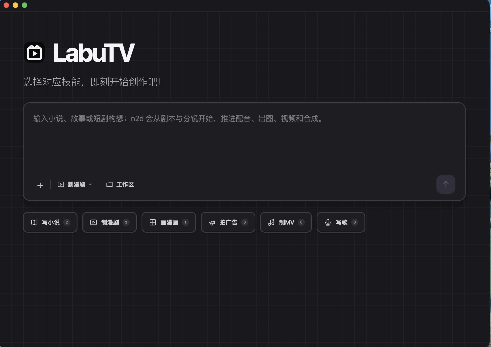
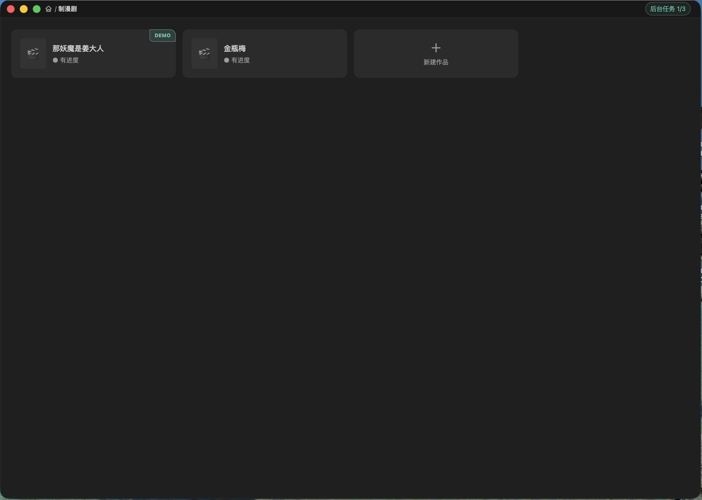
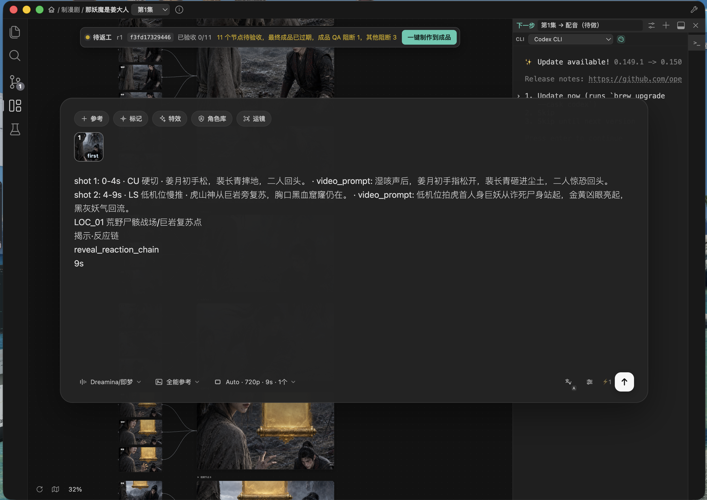
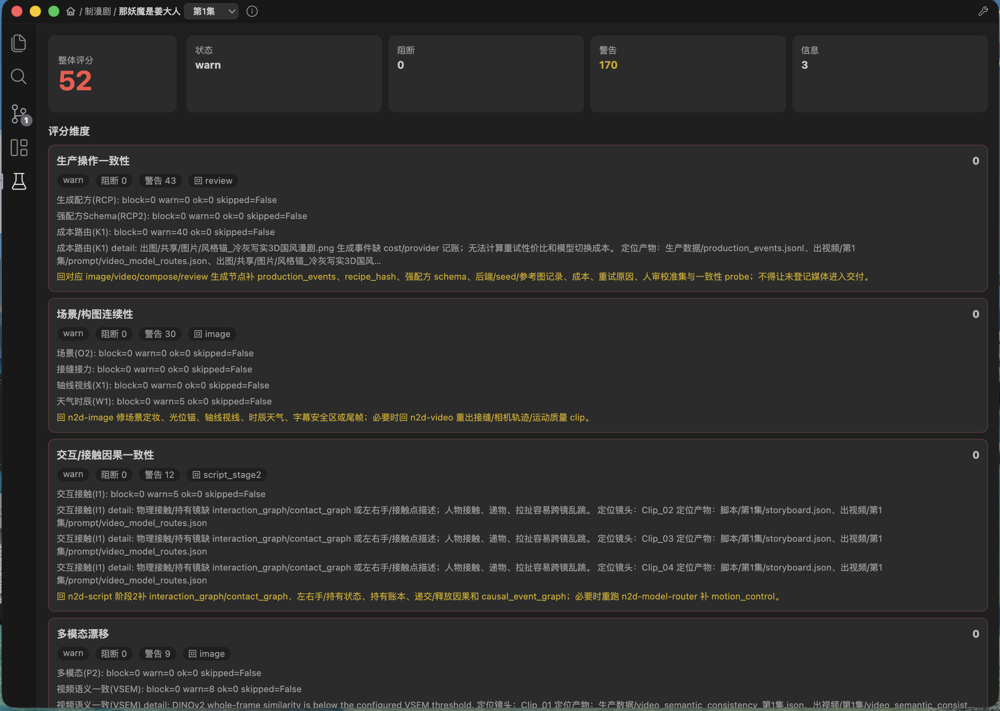
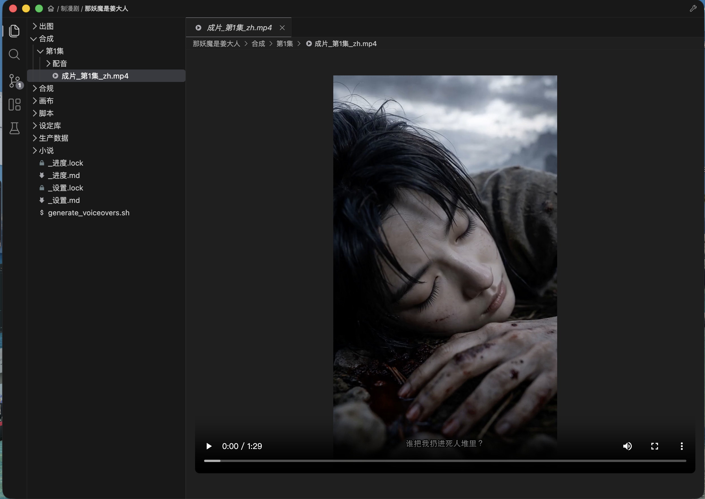
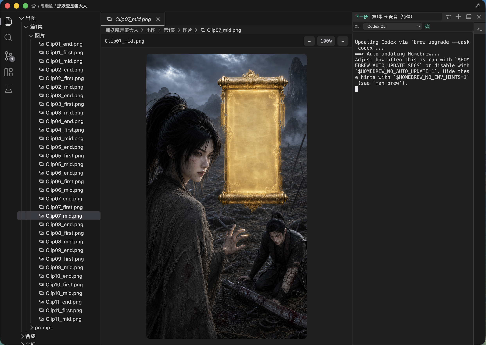
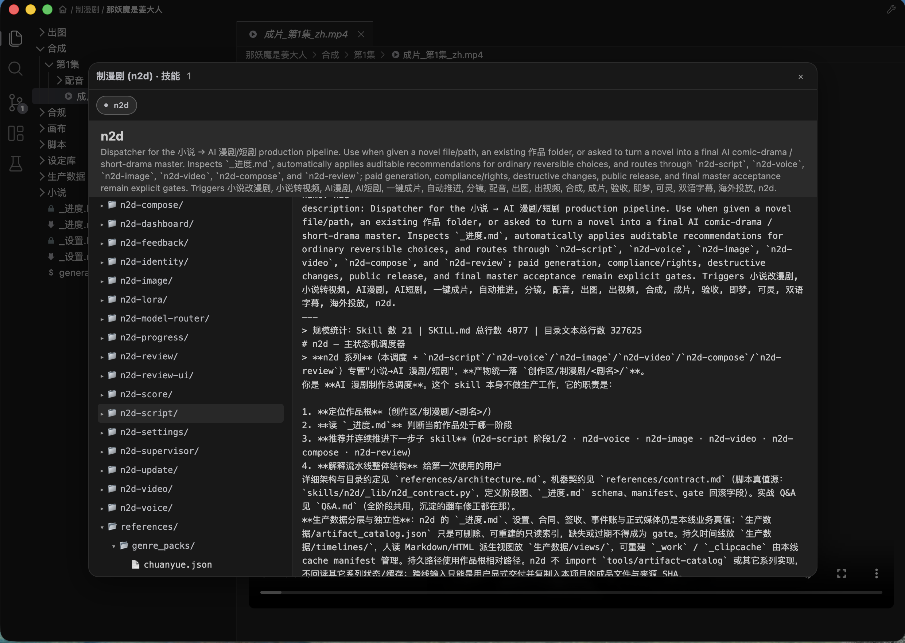

# LabuTV Desktop（Electron）产品与使用指南

> 文档版本：2026-08-28  
> 适用对象：希望使用 LabuTV 管理本地 AI 内容生产的创作者、工作室与维护者  
> 版本说明：本文截图来自 2026-08-28 的当前开发版。公开下载页中的最新 Electron 安装包发布于 2026-07-23，品牌名和部分功能早于本文截图；在新版 Release 发布前，不应据此认定公开安装包已经包含截图中的全部能力。

## 1. LabuTV 是什么

**LabuTV Desktop** 是一个面向 AI 内容生产的本地 Electron 创作工作台。它把作品文件、workflow skill、分镜画布、媒体预览、制作进度、质量报告和本机 AI Agent CLI 放进同一个桌面界面，帮助创作者从一个点子或一份源材料持续推进到可检查、可返修、可验收的交付物。

当前工作区包含六条彼此独立的创作线：

| 创作线 | 入口 | 主要目标 |
|---|---|---|
| 写小说 | `novel` | 从题材、设定与大纲推进到小说正文、审稿和导出 |
| 制漫剧 | `n2d` | 从小说、故事或短剧构想推进到剧本、配音、画面、视频和成片 |
| 画漫画 | `comic` | 从故事与分格脚本推进到排版、出图、嵌字和长图/页漫 |
| 拍广告 | `ad` | 从 brief 推进到创意、脚本、素材、视频与广告交付件 |
| 制 MV | `mv` | 从歌曲与节拍推进到视觉脚本、镜头、字幕和 MV 成片 |
| 写歌 | `song` | 从主题与歌词推进到作曲、演唱版本、审听与交付 |

`anime-armory` 是公开仓库名和历史兼容代号；对外产品名为 **LabuTV**。本文重点介绍 Electron 桌面端及其中的「制漫剧（n2d）」生产体系。

### 1.1 它解决什么问题

传统的 AI 内容制作经常分散在文件夹、网页生成平台、多个终端、表格和聊天记录中。LabuTV 把这些对象统一到“工作区 → 系列 → 作品 → 集/话 → 节点与产物”的结构中：

- 在首页用自然语言和附件发起作品；
- 让本地 Agent 按所选 skill 和当前进度继续执行；
- 在画布中检查镜头依赖、编辑内容、选择性重生成；
- 在文件区直接编辑文本、查看图片、音频、视频和生产报告；
- 在质量页查看阻断、警告、证据和返工方向；
- 在一个作品离开前台后，允许其 Agent 任务继续运行；
- 用同一套状态、哈希和完成定义判断“当前产物还能不能继续用”和“是否真的完成”。

### 1.2 它不是什么

LabuTV 不是一个把所有模型、账户和无限额度打包进安装程序的“全离线生成器”。安装包包含桌面界面和 workflow skills，但实际生成仍取决于用户已经安装并授权的 Agent CLI、模型后端、第三方账户、本地生成环境和可用额度。

它也不会把以下状态混为一谈：

- 服务商返回生成成功；
- 队列任务完成；
- 文件夹中已经出现 MP4；
- 质量检查通过；
- 当前母版被最终验收。

这些只是不同层级的证据。最终交付仍须满足当前完成定义，并绑定当前产物的有效验收回执。

## 2. 下载与安装

### 2.1 公开下载地址

- [GitHub Releases 下载总页](https://github.com/anton6202527/anime-armory/releases)
- [当前公开 Electron Release：electron-v0.1.0](https://github.com/anton6202527/anime-armory/releases/tag/electron-v0.1.0)
- [公开源码仓库](https://github.com/anton6202527/anime-armory)

截至 2026-08-28，公开的 latest Electron Release 为 `electron-v0.1.0`，发布于 2026-07-23：

| 文件 | 平台/用途 | 下载 |
|---|---|---|
| `AnimeArmory_electron_macos_arm64.dmg` | macOS Apple Silicon（M 系列）Electron 桌面端 | [直接下载 DMG](https://github.com/anton6202527/anime-armory/releases/download/electron-v0.1.0/AnimeArmory_electron_macos_arm64.dmg) |
| `SHA256SUMS.txt` | 安装包校验和 | [下载校验文件](https://github.com/anton6202527/anime-armory/releases/download/electron-v0.1.0/SHA256SUMS.txt) |
| `anime-armory.vsix` | VS Code 扩展，不是 Electron App | [直接下载 VSIX](https://github.com/anton6202527/anime-armory/releases/download/electron-v0.1.0/anime-armory.vsix) |

> 当前公开 DMG 仍使用重命名前的 `AnimeArmory` 文件名和应用品牌。它是 LabuTV 的历史 Electron 构建，不是本文截图所示 2026-08-28 开发版的完整发布包。

当前 Release **没有 Windows Electron 安装包**。历史 Release 中的 Windows EXE 属于已经退役的旧 Tauri 桌面端，不应把它当作与本文界面和能力一致的 LabuTV Electron 版。macOS Intel 和 Linux 安装包目前也未公开发布。

### 2.2 校验安装包

当前公开 DMG 的已发布信息：

- 文件大小：`171343727` bytes
- SHA-256：`8e033dd73b1ed4ed1b03f1930e4f57bedde4533b7c02e0f8df31a3e0fa6947b2`

下载后可在 macOS 终端执行：

```bash
shasum -a 256 AnimeArmory_electron_macos_arm64.dmg
```

输出应与 Release 中的 `SHA256SUMS.txt` 一致。

### 2.3 macOS 安装

1. 确认电脑是 Apple Silicon（M 系列）Mac。
2. 从 Releases 页下载 DMG，并按上节校验 SHA-256。
3. 打开 DMG，把应用拖入 `/Applications`。
4. 首次打开时按 macOS 提示授予需要的目录访问权限。
5. 如果系统阻止首次启动，在确认下载来源和校验和后，可在 Finder 中右键应用并选择“打开”，再按系统提示继续。

当前公开 Release 没有可核实的 Apple Developer ID 公证声明，不建议关闭 Gatekeeper 或清除系统整体安全设置。

### 2.4 生成能力的准备

LabuTV 会检测本机可用的 Claude、Codex、OpenCode、Gemini、Kimi 等 Agent CLI，并始终提供原生 Shell。开始正式制作前，建议至少完成：

1. 安装并登录一个受支持的本地 Agent CLI；
2. 按要使用的图片、视频、语音或音乐后端完成各自授权；
3. 确认模型费用、调用上限和项目预算；
4. 准备具有合法使用权的源小说、图片、声音、字体和音乐等素材；
5. 在 LabuTV 中选择一个专用作品工作区。

右侧 Agent 下拉中的调色板图标只表示检测结果为“支持或可能支持图像能力”，不保证当前账户、模型或 CLI 一定能够完成生图。

## 3. 核心概念

| 概念 | 含义 |
|---|---|
| 工作区 | 用户作品所在的本地根目录。新安装默认使用 `~/LabuTV`；若机器只有旧 `~/AnimeArmory`，应用会兼容沿用。 |
| 系列 | 写小说、制漫剧、画漫画、拍广告、制 MV、写歌六条生产线。 |
| 作品 | 一部小说、一部漫剧、一组漫画、一支广告/MV 或一首歌的独立工程目录。 |
| 集/话 | 视觉作品的生产与质检单元，可在顶栏切换。 |
| skill | 定义制作方法、状态、输入输出、检查与边界的 workflow。 |
| Agent | 在右侧真实 PTY 中运行的本地 AI 编码/创作 CLI，负责读取 skill 并执行任务。 |
| 画布节点 | 镜头、图片、共享资产和视频等可视对象；节点之间的线表示当前可见对象的真实依赖。 |
| 生产前沿 | 当前作品基于 `_进度.md`、设置和阶段合同计算出的唯一下一步。 |

LabuTV 的创作工程默认是普通本地目录。文本、JSON、图片、音频、视频和报告都可以在文件树中找到，而不是只存在于某个封闭数据库中。

## 4. 首页：从一个 Prompt 开始



首页是新需求的统一入口。

| 区域/按钮 | 功能 |
|---|---|
| 大输入框 | 输入题材、故事、小说改编要求或其它创作需求。`Enter` 提交，`Shift+Enter` 换行。 |
| `+` | 选择本地附件。已选文件会显示在输入框下方，可逐个移除。 |
| 技能选择器 | 在六条创作线之间切换；菜单内可进入当前系列的 skill 详情。 |
| `工作区` | 切换作品保存目录。切换整个工作区会结束当前保留的作品会话。 |
| 右下上箭头 | 创建新作品、打开工作台，并把启动请求交给首选 Agent CLI。没有 Prompt 和附件时不可提交。 |
| 底部系列卡 | 进入该系列的作品列表；右侧数字是当前工作区中的本地作品数量。 |

首页提交并不是“在首页直接调用一个模型”。应用会：

1. 根据 Prompt 或附件推导一个作品名，并在重名时自动加序号；
2. 在所选系列下创建作品目录；
3. 把系列、Prompt、附件路径，以及“先读 `_进度.md` 和 `_设置.md`”整理成一条稳定启动请求；
4. 打开作品工作台，选择本机首选 Agent CLI；
5. CLI 进入稳定状态后自动执行首轮请求。

如果 CLI 切换、参数解析或启动失败，请求不会立刻丢弃；应用会保留待发送状态并做有限重试。

一个适合制漫剧的首页 Prompt 示例：

```text
把我附加的原创悬疑小说改编成 12 集竖屏漫剧。先做第 1 集样片，
保持两位主角跨镜头外形一致，风格偏写实东方奇幻；完成后继续推进配音、
分镜、出图、视频、字幕和母版质检。普通可逆选择采用推荐方案。
```

## 5. 系列作品列表与后台任务



进入「制漫剧」等系列后，作品以卡片显示：

- 点击作品卡进入工作台；
- 卡片可显示封面、简介和是否已有进度；
- 鼠标移到本地作品上可使用垃圾桶按钮，确认后作品会移到系统废纸篓；
- `新建作品` 先输入名称，再创建并打开空工程；
- 未安装的官方 Demo 可以显示为下载卡。应用会匿名从公共 R2 下载，核对字节数和 SHA-256 后安全安装；
- 每个系列最多展示一个官方 Demo，制漫剧优先展示《那妖魔是姜大人》。其它作品仍是正常本地作品，但不会被标成第二个 Demo。

### 5.1 `后台任务 n/3`

从制作中的作品切回首页、系列列表或另一部作品时，原工作台只是被隐藏，其 PTY/Agent 可以继续运行。应用在同一 renderer 会话中最多保留 **3 个作品工作台**，当前作品计入上限。

- 再次打开某作品，会把它提升为最近使用（MRU）；
- 打开第 4 个不同作品时，最久未访问（LRU）的工作台会被卸载；
- 被淘汰工作台自己的 PTY 会结束，界面会提示作品名；
- 切换整个工作区、删除作品、手动关闭终端会话或退出 App，也会结束相应任务。

这不是系统级守护进程：退出 LabuTV 后，任务不会继续；后台工作台也不会跨应用重启自动恢复。

## 6. 作品工作台总览



### 6.1 顶栏

| 控件 | 功能 |
|---|---|
| 首页图标 | 返回 LabuTV 首页，但保留当前作品工作台供后台运行。 |
| 系列名 | 返回当前系列作品列表。 |
| 作品名 | 显示当前工程。 |
| 集数下拉 | 在当前作品的集/话之间切换。 |
| 信息图标 | 显示画布数据来源，例如 storyboard 或回退来源。 |
| 右上扳手 | 打开当前系列的 skill 浏览器。 |

### 6.2 左侧活动栏

活动栏从上到下提供：

1. **文件**：真实作品目录、文本编辑和媒体预览；
2. **搜索**：作品内搜索，支持大小写、全词、正则和确认后替换；
3. **变动**：应用自己的本地基线、A/M/D 状态、差异、归档与恢复；这不是 Git；
4. **画布**：n2d、comic、ad、mv 等视觉系列的镜头与资产工作台；
5. **质检**：聚合评分、问题、证据和返工方向。

再次点击当前活动栏图标可收起或恢复对应面板，分隔线可以拖动改变宽度。

常用快捷键：

| 操作 | macOS | Windows/Linux |
|---|---|---|
| 文件 | `⌘⇧E` | `Ctrl+Shift+E` |
| 搜索 | `⌘⇧F` | `Ctrl+Shift+F` |
| 变动 | `⌃⇧G` | `Ctrl+Shift+G` |
| 收起/展开左侧 | `⌘B` | `Ctrl+B` |
| 显示/隐藏终端 | `⌘J` | `Ctrl+J` |
| 打开并聚焦终端 | ``Ctrl+` `` | ``Ctrl+` `` |

### 6.3 画布生产状态条

画布顶部状态条展示：

- 当前状态：草稿、待制作、制作中、待返工、已阻断或已完成；
- revision；
- 当前内容哈希的短值；
- 已验收节点数/总节点数；
- 待验收节点、节点 QA、最终成品缺失/过期等阻断原因；
- `一键制作到成品`、`验收最终成品` 或完成状态。

`一键制作到成品` 会推进安全、可逆、已授权的下一步，不是绕过所有闸门的同步按钮。候选产物先写入任务隔离位置，经过路径、哈希、媒体探测、QA 和回执校验后，才会提升为稳定目标。

### 6.4 画布节点与连线

- 画布优先以 `脚本/<集>/storyboard.json` 为可编辑源，其次为漫画的 `panel_script.json`；没有权威源时才完整回退到生产数据中的 review UI；
- 节点可以拖动，布局单独保存；
- 镜头编辑弹窗可以修改标题、时长、场景、节奏、模板，以及 image/video/positive/negative prompt；
- 回写会检查源哈希，避免用旧界面覆盖刚被其它任务修改的新内容；
- 视频节点支持播放、暂停、进度、音量，以及把首帧、尾帧或当前帧截回作品；
- 连线只连接当前可见节点。共享素材连线还要求同一个可见源节点至少扇出到两个可见目标；一对一共享引用保留在节点元数据中，但不绘制跨画布长线。帧到视频等直接依赖只要两端可见仍正常显示；
- 左下可整理画布、开关小地图、输入缩放百分比、放大/缩小和适合屏幕。

## 7. 单个镜头的生成与二次创作

点击画布里的图片或视频生成位，会打开截图中的媒体详情弹窗。

### 7.1 顶部工具

| 按钮 | 功能 |
|---|---|
| `参考` | 从项目素材中选择本次生成要绑定的参考图。 |
| `标记` | 添加主体、构图、动作、光线等制作约束。 |
| `特效` | 选择电影光晕、粒子、体积光、速度拖影、景深呼吸、胶片颗粒等效果意图。 |
| `角色库` | 优先选择项目角色参考；没有专门角色项时回退到可用项目参考。 |
| `运镜` | 仅视频任务显示；选择固定、推进、后拉、横移、环绕、跟随、手持等运镜模板。 |

中间文本区用于编辑当前节点的生成 Prompt。上方缩略图表示已经选中的参考素材，点击可以取消。

### 7.2 底部生成栏

| 控件 | 功能 |
|---|---|
| 模型/渠道 | 选择当前项目适配层登记且可用的模型或后端。选项会随机器、账号和项目设置变化。 |
| 生成模式 | 图片可选文生图/图片参考；视频可按模型能力选择文生视频、图生视频、首尾帧、多关键帧、全能参考等模式。 |
| 规格 | 设置比例、清晰度、视频时长、是否原生音频和生成数量。超过单段时长上限时可按项目接力合同拆段。 |
| 语言 | 在项目默认、中文、英文 Prompt 之间切换。 |
| 调优图标 | 打开同一规格设置面板。 |
| `⚡n` | 当前生成数量的醒目提示，不应把它当作模型余额或最终账单。 |
| 上箭头 | 保存绑定当前内容哈希的任务与配置，并把精确制作指令派发给活动 Agent。 |

Electron 会先建立可追溯任务，再由活动 Agent 和对应 skill 调用真实后端；因此不应理解为桌面界面本身原生集成了所有模型 API。缺少可用模型、Agent、内容哈希或必要配置时，发送按钮会保持不可用或任务会进入阻断状态。

## 8. 质量洞察与返工



质量页聚合项目中已有的 score、review、dashboard 和阶段证据，主要包括：

- 整体评分、状态、阻断、警告和信息数量；
- 生产操作一致性；
- 场景、构图、轴线、天气与光位连续性；
- 角色身份、互动、接触、道具与因果一致性；
- 多模态、字幕、音画同步、声音和节奏等维度；
- 每个问题的来源、定位、影响镜头和证据路径；
- 建议返回的制作阶段与 skill；
- 可以打开的报告、媒体和返工任务。

文件变化后，页面会重新聚合可用报告。它不是一个始终在线、自动观看全部像素的“实时 AI 质检服务”；如果相应 review/score 没有运行，页面会明确显示暂无数据。

页面中的分数和 `warn/block` 是生产决策证据，不等同于最终 release verdict，也不构成平台审核保证或法律意见。

## 9. 文件、图片、音频与视频预览



文件区直接映射作品目录：

- 单击文件临时预览，双击固定为标签页；
- Markdown、文本、JSON 等使用编辑器查看和修改，保存时有 mtime 冲突保护；
- DOCX 提供只读预览；
- 图片、音频、视频直接内嵌预览；
- 视频通过本机回环 Range 媒体服务播放，必要时后台检查或转换编码；
- 文件树会显示新增、修改、删除装饰；
- 大目录采用虚拟化和分页/数量上限，避免一次渲染全部文件。

右键菜单可按对象提供：新建文件/文件夹、在 Finder 中显示、用系统应用打开、在集成终端中打开目录、复制名称/绝对路径/相对路径、重命名和移到系统废纸篓。



图片预览右上角的 `− / 百分比 / +` 用于 25%–600% 缩放，也支持 `Cmd/Ctrl + 滚轮`。百分比按钮恢复适应窗口。

如果视频无法播放，请先确认文件未损坏且本机可用 FFmpeg；“必要时转换”不代表任意视频编码都一定可以直接播放。

## 10. 右侧「下一步」与 Agent 终端

右侧区域由下一步提示、Agent 选择器和真实 PTY 组成。

| 控件 | 功能 |
|---|---|
| `下一步` | 读取当前作品 `_进度.md`，显示当前生产前沿。 |
| 调节/设置图标 | 打开 `_设置.md`、`_进度.md` 和解析后的下一步详情。 |
| `+` | 新建独立终端会话。 |
| 停靠图标 | 在右侧栏和底部面板之间切换终端。 |
| `×` | 隐藏终端面板，不等同于删除作品。 |
| CLI 下拉 | 在原生 Shell 和检测到的 Claude/Codex/OpenCode/Gemini/Kimi 等 Agent 间切换。 |
| 右侧会话栏 | 切换或关闭多条 PTY 会话。 |

终端区域和左侧面板都可以拖动调整大小；双击分隔线恢复默认。关闭具体会话会结束该会话中的任务，隐藏面板则主要是界面操作。

## 11. 内置 skill 浏览器



skill 浏览器用于理解当前系列的能力和边界：

- 顶部显示系列名与顶层入口数量；
- 左侧选择顶层 dispatcher；
- 中间树形浏览其嵌套子 skill、scripts、references 和其它文件；
- 右侧只读展示 frontmatter description、SKILL.md 正文或可预览媒体；
- `Esc`、右上 `×` 或点击遮罩关闭。

当前「制漫剧」只展示一个顶层入口 `n2d`。截图里的“技能 1”表示**一个面向用户的顶层调度入口**，不表示内部只有一个制作环节。历史子 skill 仍嵌套在 `skills/n2d/` 中，由 n2d 按当前前沿自动分诊。

skill 浏览器是阅读界面，不会在点击文件时自动安装、编辑或执行 skill。四个以 `app-` 开头的画布/Web App 独立 skill 也不属于 n2d 系列列表。

## 12. 制漫剧（n2d）：一个入口，21 个专业职责

LabuTV 的「制漫剧」面向“小说、故事梗概或已有制漫剧工程 → AI 漫剧/短剧母版”的完整生产。前台只暴露 `n2d` 一个主入口；后台由 21 个职责清晰、共享同一项目状态的 skill 完成编剧、声音、分镜、出图、视频、剪辑合成、质检和反馈闭环。用户不需要手工在这些 skill 之间编排顺序。

### 12.1 入口与制作控制

| skill | 作用 |
|---|---|
| `n2d` | 总入口：定位作品、读取进度、检查源内容变化，并路由到正确阶段。 |
| `n2d-supervisor` | 一键制作总控：持续读取当前前沿，推进安全、可逆、已授权的步骤。 |
| `n2d-progress` | 只读进度向导：汇总做到哪里、下一步和可并行事项。 |
| `n2d-settings` | 统一管理制作模式、风格、画幅、模型/渠道、字幕和合成策略。 |
| `n2d-update` | 规则或素材变化后的最小重制计划，尽量只返工受影响镜头。 |

### 12.2 主制作流水线

| skill | 作用 |
|---|---|
| `n2d-script` | 源文理解、拆集、台词/BGM/封面、角色/场景卡、导演排戏、故事板、素材清单、字幕、Animatic 和制片拆解。 |
| `n2d-voice` | 声音选角、无 WAV 时间基准、表演/导引音轨和最终逐句配音。 |
| `n2d-image` | 角色、场景、道具定妆和逐镜出图；利用共享定妆库与逐图 QC 降低漂移。 |
| `n2d-video` | 逐镜视频 Prompt、图生视频、视觉合同继承、接缝与 Clip 验收。 |
| `n2d-compose` | 维护 OTIO 编辑时间线，装配 Clip、对白、环境/拟音、BGM、字幕并输出母版。 |
| `n2d-review` | 检查崩脸、漂移、构图、字幕、音画、节奏、接缝、合规和交付完整性，并定位返修阶段。 |

### 12.3 一致性与生成适配

| skill | 作用 |
|---|---|
| `n2d-model-router` | 按镜头类型、音画顺序、身份锁和后端能力选择 primary/fallback。 |
| `n2d-identity` | 管理角色参考组、Face Lock/Character ID，以及脸部和音色跨集漂移。 |
| `n2d-lora` | 在核心长线角色确需更重身份锁时管理 LoRA 数据、训练、验证和登记。 |
| `n2d-asset-market` | 在制漫剧系列内导出/导入自包含的角色、场景、道具、服装、特效和路由资产包。 |

### 12.4 质量、合规与规模化

| skill | 作用 |
|---|---|
| `n2d-compliance` | 整理源文本/改编权、肖像、声音克隆、平台、地区和 AI 内容标识事项。 |
| `n2d-dashboard` | 记录成本、耗时、生成次数、重抽原因、一次通过率、QA 与投放数据。 |
| `n2d-batch` | 多集/多镜头队列、并发、重试、租约、断点恢复和按影响范围重跑。 |
| `n2d-score` | 汇总角色 DNA、场景/构图、字幕、音画、节奏、风格和音色等自动评分。 |
| `n2d-review-ui` | 生成静态证据审阅界面与生产看板；它不另建业务状态，也不等同 Electron 可编辑画布。 |
| `n2d-feedback` | 导入留存、追更、跳出和 A/B 数据，为下一轮开场、封面和节奏提供依据。 |

### 12.5 典型制作流程

1. **输入与立项**：输入小说、故事或短剧构想，建立作品工程。
2. **源文理解与开发包**：整理人物动机、因果、伏笔、改编边界和系列承诺。
3. **剧本改编与围读**：拆集并形成台词、BGM、封面、角色与场景卡，先低成本发现对白和时长问题。
4. **声音与时间基准**：完成声音选角和时长估算；需要时生成最终配音或表演音轨。
5. **导演排戏与分镜**：确定节拍、轴线、景别、转场、竖屏构图、故事板、字幕和 Animatic。
6. **制片拆解**：明确资产、连续性、通告、种子与批处理计划。
7. **出图**：先做跨集共享定妆，再做本集逐镜画面，并逐张登记和检查。
8. **出视频**：按镜头能力路由生成 Clip，检查身份、动作、接缝和画面合同是否继承。
9. **合成成片**：装配视频、配音、环境/拟音、BGM、字幕与屏幕文案，输出 canonical 母版。
10. **审查与签收**：聚合机检、评分、可视化检查、生产锁与发布裁决，最终由人接受当前母版。
11. **反馈与复用**：回灌平台数据，把稳定且授权清楚的资产沉淀为可复用资产包。

### 12.6 “一键”会在哪里继续、在哪里暂停

普通构图、节奏、Prompt 和其它可逆参数会优先采用已记录的推荐方案。已经批准且输入、范围、模型、渠道、调用上限、费用上限和有效期都没有变化的预算包内，不应为每张图、每个 Clip 重复询问。

以下情况仍会暂停：

- 新建、扩大或过期的付费阶段预算，或者成本没有可信上限；
- 源文本改编权、肖像权、声音克隆等合规事实不完整；
- 本机或所选服务没有真实可执行能力；
- 删除、覆盖、公开发布、投放等不可逆操作；
- 当前像素存在必须由人判断的硬伤；
- 最终母版验收。

更准确的产品承诺是“尽量少打断的连续生产”，而不是“无人值守自动做完无限集数”。推荐先用第 1 集锁定画风、角色、声音和模型路由，再通过小批量队列逐步放量。

## 13. 一个状态、一个哈希、一个完成定义

LabuTV 和 n2d 避免让看板、队列、服务商状态和文件存在性各自宣布一套“完成”。

### 一个状态

作品的权威业务前沿由 `_进度.md`、阶段合同和当前输入共同决定。下一步只认调度器计算出的当前 production frontier；看板、队列、后台任务和 telemetry 都是派生视图。

### 一个哈希

正式 Prompt、图片、视频和复用产物绑定 canonical 内容指纹，覆盖直接输入、参考素材、模型、渠道、能力和路由。输入或生成条件变化时，旧结果会被判定为过期；母版回执还会绑定媒体、交付规格和渲染配方。

### 一个完成定义

服务商 `succeeded`、队列 `done`、进度格 `✅` 或已有 MP4 都只是阶段证据。只有当前 release/completion verdict 通过，并存在绑定当前 canonical 母版的新鲜验收回执，才能宣布最终成品完成。

需要区分：

- `clip_delivery_complete`：逐镜 MP4 已齐，可供内部预览或交给专业剪辑；
- `master_delivery_complete`：合成、技术 QA、创作听看、锁版和最终验收都已完成。

母版完成也不自动等同于中国发行、海外发行和商业投放全部就绪，这些场景有各自的权利与平台要求。

## 14. 本地数据、网络与安全边界

- 公开桌面端没有账号登录或作品上传入口；新建和修改的作品默认保存在本地工作区。
- 官方 Demo 从公共 Cloudflare R2 匿名下载，并在安装前核对字节数和 SHA-256。
- 调用外部 Agent 或云模型时，用户主动提交的 Prompt、图片、音频、视频或其它素材可能按所选服务商条款发送到外部服务；“本地工作区”不等于所有生成都离线。
- Electron 提供仅监听 `127.0.0.1` 的受控本地桥接。浏览器端首次使用需经过桌面确认；该桥接不会向网页开放任意 Shell 和任意文件路径。
- 删除作品和文件会要求确认，并优先移到系统废纸篓。
- 源小说、角色、音乐、声音、肖像、字体、商标和其它输入素材应有合法使用或改编授权；真人仿声和声音克隆必须获得授权。
- 自动评分、机检和状态提示不构成法律意见、平台审核保证或最终真人验收。
- 公开仓库当前没有根 LICENSE，本文不把它描述为可自由商用或自由再分发的开源项目；具体使用与分发权应以维护者后续许可证为准。

## 15. 常见问题

### 首页提交后，Prompt 没有在 CLI 中执行怎么办？

先检查右侧是否已经进入可用 Agent，而不是只有原生 Shell；确认该 CLI 已安装、已登录并能稳定启动。首页请求只有在目标 CLI 进入稳定窗口，或单次模式成功退出后才会被消费。失败请求会有限重试；仍未执行时，可以保留作品并在右侧 Agent 中重新提交同一需求。

### 为什么“一键制作到成品”停下了？

查看画布顶部的阻断原因和质检页。常见原因是节点尚未验收、QA block、最终产物缺失/过期、预算包变化、权利信息不完整、后端不可用，或仅剩最终验收。

### 为什么质量页没有分数？

质量页聚合已有的 score/review/dashboard 报告。相应检查尚未运行、报告格式不受支持或产物还没生成时，会显示暂无数据。

### 切到别的页面后任务还会继续吗？

会，只要 LabuTV 仍在运行、该作品仍位于最多 3 个保留工作台内，而且终端会话没有被手动关闭。第 4 个不同作品会按 LRU 淘汰最久未访问的工作台。

### 为什么画布有的线不显示？

连线只表达当前可见节点之间的真实依赖。若共享素材只有生产元数据，没有对应的可见图片/文字源节点，应用不会创建透明锚点或无源连线。

### 为什么公开安装包和截图不完全一样？

截图来自 2026-08-28 当前开发版；公开 latest Electron 安装包发布于 2026-07-23，仍使用 AnimeArmory 历史品牌名。请以各 Release 的 tag、说明和资产列表判断具体功能。

### Windows 从哪里下载？

当前尚未公开与本文一致的 Windows Electron 安装包。请关注 [Releases 页](https://github.com/anton6202527/anime-armory/releases)，不要把历史 Tauri EXE 当作当前 Electron 版。

## 16. 从源码运行（维护者）

```bash
git clone https://github.com/anton6202527/anime-armory.git
cd anime-armory/apps/desktop
npm install
npm run dev
```

常用命令：

```bash
npm run build   # 类型检查并构建 Electron 三进程产物
npm run dist    # 使用 electron-builder 生成安装包
```

开发端默认把作品放在 `~/LabuTV`，也可以通过应用菜单切换工作区。技术架构、受控 Web 桥接、打包和冒烟测试见 [`apps/desktop/README.md`](../apps/desktop/README.md)。

## 17. 相关资料

- [LabuTV / anime-armory 公开仓库](https://github.com/anton6202527/anime-armory)
- [GitHub Releases](https://github.com/anton6202527/anime-armory/releases)
- [仓库首页与快速开始](../README.md)
- [全部 skill 索引](../skills/README.md)
- [Electron 桌面端技术说明](../apps/desktop/README.md)
- [skill 设计原则](skill-design-principles.md)
- [Web App 架构](web-app-architecture.md)
