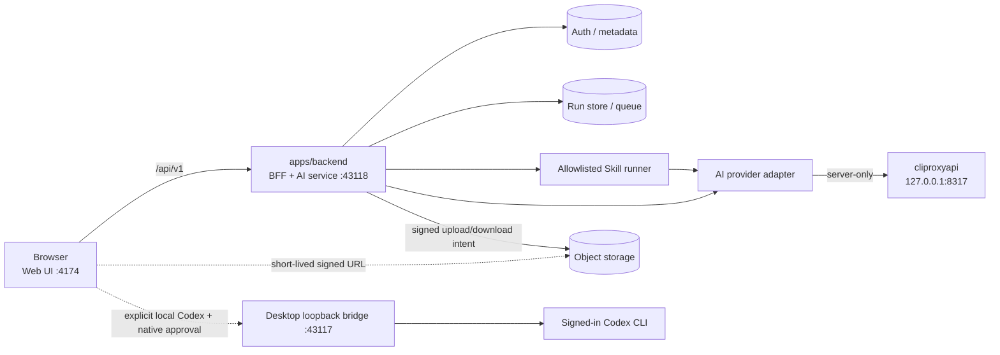

# Web App 目标架构

> 状态：目标架构，供后续实现与迁移验收使用。更新时间：2026-08-22。

## 0. 2026-08-17 落地状态

本轮已经落地可运行的本地 AI / Skill 纵切面：

- Browser 的常规模型发现、文本/图片生成、Skill source、工作文件上传和 Skill run 只调用同源 `/api/v1`。唯一受控例外是用户显式选择、并经桌面原生授权的本机 Codex Agent executor。
- `apps/backend` 已提供 loopback REST 服务（默认 `127.0.0.1:43118`），统一校验请求、读取 allowlisted Skill、维护内存任务队列，并在服务端调用 `cliproxyapi`。
- Web 已移除默认 `43117` 模型路径、Vite 模型中间件和 Skill 源码 `import.meta.glob` 打包；现在仅为本机 Codex 保留契约隔离的 loopback adapter。四个独立画布 workflow 也不再用计时器伪造成功。它们的正式 ID 是 `app-script-workbench`、`app-character-turnaround`、`app-first-frame-video` 和 `app-audio-video`。
- 文本生成和一个真实的角色三视图 Skill run（现 `app-character-turnaround`）已完成端到端 smoke；后者实际经历 `queued -> succeeded` 并返回真实 text artifact。

当前可直接联调的 MVP 路由是：`GET /api/v1/health/live|ready`、`GET /api/v1/ai/models`、`POST /api/v1/ai/generations`、`GET /api/v1/skills[/:id]`、`GET /api/v1/skills/:id/sources`、`GET /api/v1/skills/:id/source?path=...`、`PUT /api/v1/works/:workId/files/:fileId`、`POST /api/v1/skill-runs` 以及 `GET|DELETE /api/v1/skill-runs/:runId`。第 4 节描述的是生产目标合同，不能当成本地 MVP 已实现清单；本地请求示例见 `apps/backend/README.md`。

以下仍是目标态，不应误写成已经完成：

- 账号、用户设置、用户 Skill、画布云同步和旧资产 API 的 Browser client 已在本地 Web 停用，旧 `VITE_SUPABASE_*` / `VITE_ASSET_API_URL` 不再启用直连；这些产品能力当前降级为本地/未配置模式，必须在第二阶段迁入 BFF 后才能恢复。
- AI generation 的本地 MVP 当前是同步 `POST`；Skill run 是异步轮询但仅存内存，服务重启后不保留。生产前再落持久队列、`Location`、取消/恢复和鉴权。
- 本地 BFF 依赖 loopback Host 与显式 CORS Origin，不提供产品用户鉴权或多租户授权；不能直接作为公网生产服务。
- 当前 Skill runner 只调用 GPT 文本能力并返回真实文本产物。图片走 AI generation REST；音频和视频 provider 尚未接入时必须明确报能力不可用，不得伪造媒体文件。

## 1. 目标与硬边界

Web App 默认采用单一后端边界：Browser 只访问同源或部署时明确配置的 `/api/v1`。`apps/backend` 是 Browser 的 BFF（Backend for Frontend），同时承载 AI service、Skill 编排、工作文件控制面和任务状态。`cliproxyapi` 只作为后端的 AI upstream，不是面向 Browser 的产品 API。

硬性约束如下：

- Browser 不直连 `cliproxyapi`、Supabase 数据 API、R2、模型厂商或本机 Agent/CLI。
- 唯一例外是本机 Codex Agent：用户必须在模型选择器显式选择该 executor，Browser 只能连接受信 Desktop loopback bridge；bridge 校验精确 Origin、显示原生确认、签发短期内存 token，并固定 `agentId=codex`、作品范围和真实模型白名单。Browser 仍不能直连 CLI，也不能传命令、工作目录、任意路径或凭据。
- Browser 不接收上游 URL、模型凭据、服务角色凭据、对象存储凭据或本地绝对路径。
- Browser 不得在请求里指定任意 upstream、命令、脚本路径或工作目录。
- 所有模型生成和 Skill 执行都先创建后端资源，再通过资源状态返回结果；页面只负责提交、轮询、取消和展示。
- 大文件上传与下载可使用后端签发的短期 URL 走数据面直传，这是唯一常规例外；权限判定、对象键生成、完成确认和元数据仍走 `/api/v1`。

### 1.1 画布生产合同

Web 画布的目标定位是可持续二次创作、选择性重生成、质检返修并迭代到最终母版的生产工作台，不是中间产物查看层。Web 新状态只持久化四个 `app-*` 正式 ID；改名前 ID 只允许在明确的 legacy alias / migration adapter 中读取，迁移后立即写回正式 ID。Electron 遵守相同语义原则，但当前使用自己的 v2 production-state/final-product 合同，不属于本节 Web schema。

Web 的 `app-script-workbench/v3` 模型以一个生产 `state`、一个 canonical `content_sha256` 和一个完成定义作为业务真值。HTTP `202 Accepted` 只表示服务器接受请求；run 的 `succeeded`、provider 结果或 delegated-agent 回执也都只是机器证据，最多推进到 `machine_complete`，不得被映射为人审 `accepted` 或项目 `complete`。

当前 Web UI 已覆盖镜头、资产、提示词编辑和批量视频入口；生成结果回写、逐图验收、母版合成/QC 与最终验收回执输入尚未闭环。下面的 current-pixel 与 final-acceptance 规则是必须实现的目标合同：每张最终保留图片由具名真人查看当前像素并绑定 artifact 字节 SHA-256，最终母版另做具名真人验收。普通可逆选择可采用推荐值并持久化，已授权阶段预算包内连续生成与机检；`waitingForUser` 只保留给不可自动推断输入、预算包创建/扩大/过期、权利合规、逐图人审、不可逆发布/覆盖和最终验收。



## 2. 组件职责与本地端口

| 组件 | 本地地址 | 职责 | Browser 是否直连 |
|---|---|---|---|
| `apps/web` | `http://127.0.0.1:4174` | 页面、交互、轮询与结果展示；开发期把相对 `/api/v1` 反向代理到 BFF | 是 |
| `apps/backend` | `http://127.0.0.1:43118` | BFF、鉴权、REST 资源、任务编排、Skill runner、AI adapter、审计和存储控制面 | 只访问 `/api/v1` |
| `cliproxyapi` | `http://127.0.0.1:8317` | 本地开发期的 OpenAI-compatible AI upstream | 否，仅 BFF 可访问 |
| LabuTV Desktop local bridge | `http://127.0.0.1:43117` | 显式本机 Codex Agent 的模型目录、作品授权与受控任务 | 仅用户选择后 |

本地三个服务都应绑定 loopback。生产环境由 HTTPS 入口把 `/api/v1` 路由到 `apps/backend`，不向公网暴露 `43118` 或 `8317`。

`apps/backend` 的逻辑职责包括：

1. 校验用户会话、租户、作品权限、请求大小和幂等键。
2. 把产品请求转换成稳定的资源合同，不把上游响应格式泄漏给 Browser。
3. 维护 AI generation 与 Skill run 的状态、日志摘要、产物引用和取消语义。
4. 只按后端注册表执行 Skill 和动作；禁止把客户端字符串拼成 Shell 命令。
5. 通过统一 AI adapter 调用 `cliproxyapi`，注入服务端凭据并归一化超时、限流和错误。
6. 通过不透明 ID 解析 Skill source、工作文件和产物；服务端负责路径约束和内容哈希。

## 3. Browser API 入口

默认 API base 是相对路径 `/api/v1`。若部署必须跨域，只允许一个构建或部署时配置的 HTTPS base，且其 pathname 必须以 `/api/v1` 结尾；loopback HTTP 仅限本地开发。Browser 不接受用户输入或单次请求覆盖 API base。

开发期推荐：

```text
Browser -> http://127.0.0.1:4174/api/v1/*
Vite proxy -> http://127.0.0.1:43118/api/v1/*
```

这样 Browser 始终使用相对 `/api/v1`，无需持有 CORS 例外或知道 AI upstream 地址。若直接配置 `http://127.0.0.1:43118/api/v1`，BFF 必须只允许明确列出的开发 Origin，并拒绝任意 Origin、凭据反射和非 loopback Host。

本机 Codex 是独立 executor 例外，不改变 `VITE_API_BASE_URL`，也不能作为任意 upstream override。选择器把访问入口与真实模型分列：executor 为 `local-codex`，`modelId` 必须是 Desktop 从当前 ChatGPT 账号实时目录投影并在提交时再次校验的具体 slug。

## 4. REST 资源合同

JSON 字段统一使用 `camelCase`；时间使用带时区的 ISO 8601；ID 使用后端生成的不透明 UUID/ULID。列表使用 cursor pagination，不把文件系统路径作为 ID。

| 资源 | 端点 | 语义 |
|---|---|---|
| Health | `GET /api/v1/health` | 无敏感信息的存活/就绪状态；可分别报告 BFF、任务存储和 AI upstream 的 `ok/degraded/unavailable` |
| AI models | `GET /api/v1/ai/models` | 返回后端允许向当前用户展示的模型及能力；不是 `cliproxyapi /v1/models` 的原样透传 |
| AI generations | `POST /api/v1/ai/generations` | 创建文本、识图或图片生成任务，成功返回 `202 Accepted` |
| AI generation | `GET /api/v1/ai/generations/:generationId` | 获取任务状态、结果摘要和产物 ID |
| AI generation cancel | `DELETE /api/v1/ai/generations/:generationId` | 请求取消 queued/running 任务；资源保留并进入 `cancelled` |
| Skills | `GET /api/v1/skills` | 返回当前用户可见的内置/个人 Skill 目录和版本摘要 |
| Skill | `GET /api/v1/skills/:skillId` | 返回说明、输入 schema、能力、可用动作和当前版本 |
| Skill mutation | `POST /api/v1/skills`、`PATCH/DELETE /api/v1/skills/:skillId` | 创建和维护个人 Skill；内置 Skill 只读 |
| Skill sources | `GET /api/v1/skills/:skillId/sources` | 列出该 Skill 可读的源文件描述符，不把仓库路径当客户端能力 |
| Skill source | `GET /api/v1/skill-sources/:sourceId` | 读取经授权、限长的源内容；内置源只读，个人源可按权限更新 |
| Skill source mutation | `POST /api/v1/skills/:skillId/sources`、`PATCH/DELETE /api/v1/skill-sources/:sourceId` | 维护个人 Skill 源文件；内置源拒绝修改 |
| Work files | `GET /api/v1/work-files`、`GET /api/v1/work-files/:fileId` | 按作品/任务列举或读取文件元数据、哈希和可用产物 |
| Work file create | `POST /api/v1/work-files` | 小文件或元数据创建；大文件改走上传会话 |
| Work file update | `PATCH/DELETE /api/v1/work-files/:fileId` | 更新元数据或软删除；不得接受客户端绝对路径 |
| Upload session | `POST /api/v1/work-files/uploads` | 经过权限、大小、MIME 与配额检查后签发短期上传目标 |
| Upload completion | `POST /api/v1/work-files/uploads/:uploadId/complete` | 校验对象大小/哈希后物化 `work-file` 资源 |
| Skill runs | `POST /api/v1/skill-runs` | 以 `skillId + action + input + sourceIds/workFileIds` 创建执行，返回 `202` |
| Skill run | `GET /api/v1/skill-runs/:runId` | 获取运行状态、等待用户的 gate、结果和产物 ID |
| Skill run input | `POST /api/v1/skill-runs/:runId/inputs` | 向 `waitingForUser` 的运行提交结构化选择或确认；必须匹配当前 gate schema |
| Skill run cancel | `DELETE /api/v1/skill-runs/:runId` | 请求取消；已完成任务保持幂等返回 |

创建异步资源时响应至少包含：

```json
{
  "data": {
    "id": "opaque-run-id",
    "type": "skillRun",
    "status": "queued",
    "createdAt": "2026-08-17T12:00:00+08:00",
    "statusUrl": "/api/v1/skill-runs/opaque-run-id"
  },
  "meta": {
    "requestId": "opaque-request-id"
  }
}
```

同时设置 `Location` 指向状态资源。客户端可发送 `Idempotency-Key`；同一用户、同一资源类型、同一键和同一请求摘要必须得到同一任务，摘要冲突返回 `409`。

AI generation 请求只描述产品能力，不携带 upstream 配置：

```json
{
  "modality": "text",
  "capability": "text.generate",
  "model": "gpt-5.6-terra",
  "input": {
    "prompt": "...",
    "workFileIds": []
  },
  "options": {}
}
```

`model` 可省略，由后端按 capability 和项目设置选择。即使提供，也必须命中服务端动态 allowlist；请求中不得出现 `baseUrl`、provider credential、命令或路径。

Skill run 请求同样只引用注册资源：

```json
{
  "skillId": "app-script-workbench",
  "action": "run",
  "workId": "opaque-work-id",
  "input": {},
  "sourceIds": [],
  "workFileIds": []
}
```

BFF 将 `skillId + action` 映射到固定 runner、参数 schema、权限、超时、工作目录和资源上限。Skill 内需要语义生成时复用同一个 AI service/adapter，不自行读取 Browser 配置或向 Browser 索要模型凭据。

## 5. 运行状态与轮询

AI generation 状态机：

```text
queued -> running -> succeeded
                  -> failed
queued/running    -> cancelled
```

Skill run 在此基础上允许 `waitingForUser`，但普通可逆选择不得用它逐项打断：优先采用本线推荐值并持久化。它只用于不可自动推断的必要输入、预算包创建/扩大/过期、权利与合规、逐图当前像素具名人审、不可逆发布/覆盖和最终成品验收；用户提交符合当前 gate schema 的确认后回到 `queued` 或 `running`。状态资源应包含 `progress`、安全的 `message`、`result`、`artifactIds`、`createdAt/startedAt/finishedAt`，不得包含上游原始响应、进程环境或绝对路径。

Browser 轮询规则：

1. `POST` 得到 `202 + Location` 后，首次等待约 1 秒。
2. `GET` 状态资源；优先使用服务端的 `Retry-After`，否则按 1、2、4、5 秒上限指数退避并加少量 jitter。
3. 使用 `ETag` / `If-None-Match`；`304` 时不重绘页面。
4. `429` 和暂时性 `503` 只在 `retryable=true` 时继续，并服从 `Retry-After`。
5. 进入 `succeeded/failed/cancelled` 后停止轮询。页面卸载只停止轮询，不自动取消服务端任务。
6. 网络恢复后继续读取同一个状态 URL，不重复创建任务；需要重试失败任务时创建新资源并记录 `retryOf`。

首版以轮询为真值，不要求 WebSocket/SSE。未来可加事件流优化延迟，但事件流不能替代可恢复的 `GET` 状态资源。

## 6. 成功与错误 envelope

成功响应统一使用 `{ "data": ..., "meta": { "requestId": ... } }`。所有非 2xx JSON 错误统一为：

```json
{
  "error": {
    "code": "ai_upstream_unavailable",
    "message": "AI 服务暂时不可用，请稍后重试。",
    "requestId": "opaque-request-id",
    "retryable": true,
    "details": {
      "fieldErrors": []
    }
  }
}
```

基础映射：

| HTTP | 稳定错误码示例 | 说明 |
|---:|---|---|
| 400 | `invalid_request` | JSON、参数或状态转换非法 |
| 401 | `unauthorized` | 未登录或会话过期 |
| 403 | `forbidden` | 无作品、Skill、源文件或产物权限 |
| 404 | `not_found` | 资源不存在；不泄露其他租户是否拥有该 ID |
| 409 | `conflict`、`idempotency_conflict` | 版本/状态/幂等摘要冲突 |
| 413 | `payload_too_large` | 超出 BFF 或上传策略限制 |
| 422 | `validation_failed` | schema 校验失败，可返回字段级错误 |
| 429 | `rate_limited`、`quota_exceeded` | 配合 `Retry-After` |
| 502 | `ai_upstream_error` | upstream 返回不可归一化错误 |
| 503 | `service_unavailable`、`ai_upstream_unavailable` | 依赖暂不可用 |
| 504 | `ai_upstream_timeout` | upstream 超时，是否重试由任务策略决定 |

任务已经成功创建后发生的执行错误写入该任务的 `error` 字段，状态为 `failed`；轮询该资源仍可返回 `200`。BFF 日志可记录带 `requestId/runId` 的内部诊断，但 API 不返回堆栈、原始 upstream body、令牌、请求头、环境变量或本地路径。

## 7. 密钥、认证与执行边界

- AI upstream 地址和凭据只存在于 `apps/backend` 的运行环境或本机受限配置中。它们不得使用 `VITE_*` 前缀，不得进入 Browser bundle、响应、日志或任务产物。
- BFF 调用 `cliproxyapi` 时统一注入 upstream Authorization；Browser 的 Bearer token 只表示 Anime Armory 用户会话，二者不可复用。
- Supabase service role、R2 credential 和签名密钥仅后端持有。Browser 不再直接查询业务表；BFF 负责租户过滤和授权。
- `cliproxyapi` 保持 `127.0.0.1` 绑定并禁止远程管理。BFF 不代理其管理接口，也不透传任意 pathname。
- Skill runner 只执行版本化 allowlist 中的入口，使用隔离工作目录、明确超时/并发/输出上限；参数按 schema 编码传递，不经 `shell=true` 拼接。
- 工作文件、Skill source 和产物均以不透明 ID 引用。服务端解析后必须验证 canonical path 仍位于该 run/work 根目录内。
- 上传内容在进入 runner 或 AI adapter 前做 MIME、大小、哈希和必要的恶意内容检查；不信任客户端文件名。
- 日志默认脱敏 Prompt 中可能的个人信息，只保留完成诊断和审计所需的最小内容。
- 本机 Agent token 与 BFF/兼容模型 session 隔离，只存在 Desktop 内存中，绑定精确 Origin、单个作品、固定 Codex agent 和 2 小时有效期。Desktop 计算工作目录、限制附件总量/并发/产物路径，spawn 参数固定且 Prompt 走 stdin；拒绝 API-key 登录冒充 ChatGPT 订阅。

## 8. 上传与下载的数据面例外

大文件不经 BFF 进程中转时，流程必须是：

1. Browser 调用 `POST /api/v1/work-files/uploads`，提交作品 ID、文件大小、MIME 和 SHA-256。
2. BFF 校验身份、配额和用途，生成不可由 Browser 选择的对象键，并返回短期、单对象、限方法/大小的签名 URL。
3. Browser 仅向该签名 URL 上传文件字节；对象存储 CORS 只允许产品 Origin 和必要方法/头。
4. Browser 调用 `POST .../complete`；BFF 从可信存储侧核对大小、哈希和对象状态后创建 `work-file`。
5. Skill run 和 AI generation 只接收 `workFileId`，由后端读取或签发内部下载，不把永久对象 URL交给模型或 Browser。

下载可采用相同的短期签名 URL，或对小文件由 BFF 流式返回。签名 URL 是临时数据面授权，不是业务资源权限；过期后必须重新向 BFF 请求。除此之外，Browser 的后端访问仍全部经过 `/api/v1`。

## 9. 当前 GPT-only 本地开发适配

本地开发阶段只开放 GPT 系列，不因为 `cliproxyapi` 同时列出 Gemini、Claude 或其它模型就自动暴露给 Web。BFF 每次从 upstream 发现模型后再应用服务端 allowlist 和 capability 映射。

2026-08-17 本机已验证：`cliproxyapi` Homebrew service 正在 `127.0.0.1:8317` 运行，`GET /healthz` 正常，鉴权后的 `GET /v1/models` 正常。当前 BFF 实际暴露的开发模型快照为：

- 文本：`gpt-5.3-codex-spark`、`gpt-5.4`、`gpt-5.4-mini`、`gpt-5.5`、`gpt-5.6-luna`、`gpt-5.6-sol`、`gpt-5.6-terra`、`gpt-oss-120b-medium`。
- 图片：`gpt-image-1.5`、`gpt-image-2`。

该清单是运行时快照，不应硬编码成永久真值。`codex-auto-review` 不作为通用生成模型暴露；非 GPT 模型在当前阶段过滤。

开发 adapter 的协议映射：

| 产品能力 | `cliproxyapi` upstream |
|---|---|
| 模型发现 | `GET /v1/models` |
| 文本/识图 | 首选 `POST /v1/responses`；仅 upstream 明确不支持该端点时回退 `POST /v1/chat/completions` |
| 文生图 | `POST /v1/images/generations` |
| 参考图编辑 | `POST /v1/images/edits` |

模型发现成功只证明服务、鉴权与目录可用；BFF readiness 应把“目录可用”和“最近一次真实生成 smoke 成功”分开报告。不得为了通过 health 静默切换到未获准 provider。

## 10. 生产 provider adapter

业务层只依赖稳定的 `AiService` 能力，例如 `listModels`、`createTextGeneration`、`createImageGeneration`、`getGeneration` 和 `cancelGeneration`。`CliProxyDevAdapter` 负责本地协议转换；生产环境可替换为托管 OpenAI、企业 AI gateway 或其它已批准 provider adapter，而 Browser 合同保持不变。

生产适配必须补齐：

- capability-based 路由、模型版本快照、预算/配额、并发和租户级限流；
- 明确的 timeout、重试、熔断和 provider fallback 策略，禁止无记录的跨厂商降级；
- 持久任务队列、worker lease、幂等执行、取消与 dead-letter；
- 输入/输出安全检查、合规与授权 gate、审计日志和数据保留策略；
- provider 错误到稳定错误码的映射，以及生成产物的内容哈希和 provenance；
- 按能力声明文本、图片、音频、视频或其它模态，未实现能力返回明确的 `capability_unavailable`。

任何新增模型 provider 都在后端注册、配置和验证，不要求 Web 增加 provider credential，也不允许 Web 绕过 BFF 直接调用。本机 Codex 是用户主动选择的 Agent executor 例外，不是 Browser 直连 provider，也不得承载图片/视频 API 语义。

## 11. 本地启动与验证

先确保本机 AI upstream 运行：

```bash
brew services start cliproxyapi
brew services list | rg cliproxyapi
curl -fsS http://127.0.0.1:8317/healthz
```

再启动已经落地的 BFF 和 Web：

```bash
npm run dev:backend
npm run dev:web
```

验证 BFF 直连与 Browser 同源代理：

```bash
curl -fsS http://127.0.0.1:43118/api/v1/health/ready
curl -fsS http://127.0.0.1:4174/api/v1/health/ready
```

本地 BFF 只绑定 loopback；模型目录无需也绝不能使用 upstream 凭据从 Browser 调用：

```bash
curl -fsS http://127.0.0.1:43118/api/v1/ai/models
```

最小验收还应覆盖：

1. 除命名明确的本机 Codex adapter 外，Browser 不访问 `43117`；任何路径都不得访问 `8317`、Supabase 数据 API 或模型厂商。打开模型选择器最多做只读 probe，首次提交必须经原生批准；拒绝、过期或桌面未启动时明确失败且不得静默切换 executor。
2. 生产鉴权落地后，未登录访问受保护资源得到统一 `401` envelope；跨租户 ID 得到不泄露存在性的 `404/403`。
3. 当前 Skill run 返回 `202` 并可轮询；持久队列落地后再验收 `Location`、刷新恢复和 AI generation 异步资源。
4. upstream 停止时 `/health` 报 `degraded`，任务得到稳定、可重试的错误，不泄露 upstream body。
5. Browser 请求体中的 upstream URL、绝对路径、任意命令和非 allowlist Skill action 被拒绝。
6. 大文件只经短期签名 URL 直传，完成确认前不能作为 `workFileId` 使用。
7. 页面和构建产物中不存在任何模型、服务角色或对象存储密钥。
8. Browser 不能向本机 bridge 传命令、cwd 或任意路径；Desktop 只接受当前目录发现到的 Codex 模型 slug，图片/视频直接生成永不路由到 Codex CLI。

## 12. 迁移顺序

1. 在 `apps/backend` 建立 `43118` BFF、统一 envelope 和 health（已完成本地版；产品鉴权待补）。
2. 实现 `AiService` 与 `CliProxyDevAdapter`，先迁移 models 和 generations。
3. 把 Web 默认模型路径迁到相对 `/api/v1`，删除通用 `43117/8317` 探测与直连分支；只保留契约隔离、用户显式选择的本机 Codex adapter。
4. 把 Skill catalog/source 从前端打包读取迁到 `skills` 与 `skill-sources` 资源。
5. 把默认 Agent job 迁到 `skill-runs`，把附件上传迁到 `work-files`；本机 Codex 只保留作品范围内的显式 executor 合同。
6. 把账号、用户设置、用户 Skill、画布云同步和资产控制面从 Browser 直连 Supabase / Edge Function 迁到 BFF REST。
7. 接入持久任务存储、对象存储数据面和生产 provider adapter，最后移除通用 `/v1/canvas/*` 兼容入口；`/v1/agent/jobs` 只允许存在于命名明确的 Desktop 本机 Codex adapter。

迁移期允许后端内部保留兼容 adapter。除隔离的本机 Codex adapter 外，Browser 新代码只能依赖 `/api/v1` 资源合同。
